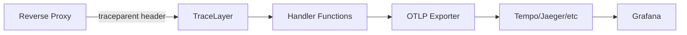

# Observability and Tracing

DSP-META implements OpenTelemetry distributed tracing to enable monitoring and debugging of requests across the service infrastructure.

## Overview

The backend uses [OpenTelemetry](https://opentelemetry.io/) with the Rust tracing ecosystem to provide:

- **Distributed Tracing**: Continue traces from reverse proxies and upstream services
- **Automatic Span Creation**: HTTP requests and instrumented functions automatically create spans
- **W3C TraceContext**: Standard-compliant trace propagation via HTTP headers
- **Flexible Export**: Optional OTLP exporter for sending traces to observability backends

## Architecture



The trace flow:

1. **TraceLayer** (`src/api/router.rs`) extracts W3C TraceContext from HTTP headers and creates an
   `http_request` span as a child of the extracted context
2. **Handler Functions** with `#[instrument]` create child spans automatically
3. **OTLP Exporter** (optional) sends spans to observability backends
4. **Grafana/Tempo** visualize the distributed traces

!!! info "Automatic Fallback"
    When no `traceparent` header is present (e.g., local development), new root spans are created automatically.

## Configuration

### Environment Variables

| Variable                      | Description                                                             | Default              | Example                 |
| ----------------------------- | ----------------------------------------------------------------------- | -------------------- | ----------------------- |
| `OTEL_EXPORTER_OTLP_ENDPOINT` | OTLP endpoint URL for exporting traces (standard OpenTelemetry env var) | Not set (local only) | `http://localhost:4317` |
| `DSP_META_LOG_FILTER`         | Log level filter                                                        | `info`               | `debug`                 |
| `DSP_META_LOG_FMT`            | Log output format                                                       | `compact`            | `json`                  |

### Local Development (No Export)

By default, traces are only logged locally:

```bash
just serve-dev
```

### Local Development with Grafana

Export traces to a local Grafana + Tempo stack:

```bash
OTEL_EXPORTER_OTLP_ENDPOINT=http://localhost:4317 just serve-dev
```

### Production

In production, configure the OTLP endpoint to send traces to your observability backend:

```bash
OTEL_EXPORTER_OTLP_ENDPOINT=https://tempo.yourcompany.com:4317
DSP_META_LOG_FILTER=info
DSP_META_LOG_FMT=json
```

## Testing Locally with Grafana

### Prerequisites

- Docker and Docker Compose
- The DSP-META repository

### Quick Start (Recommended)

The easiest way to test with observability is using the dedicated `just` targets:

=== "One Command"

    Start both the observability stack and the application:

    ```bash
    just serve-with-observability
    ```

    This will:
    1. Start Grafana LGTM stack (all-in-one observability container)
    2. Start dsp-meta with OTLP exporter enabled
    3. Display URLs for accessing the services

=== "With Hot Reload"

    For development with automatic reloading on code changes:

    ```bash
    just serve-dev-with-observability
    ```

=== "Manual Control"

    Start services independently:

    ```bash
    # Start observability stack
    just observability-up

    # In another terminal, start your app
    just serve-dev

    # When done, stop observability stack
    just observability-down
    ```

After running any of these commands, the observability stack will be available:

```text
Observability stack:
  - Grafana: http://localhost:3001
  - OTLP gRPC endpoint: http://localhost:4317
  - OTLP HTTP endpoint: http://localhost:4318
```

### Manual Setup (Alternative)

If you prefer manual control:

#### Step 1: Start Observability Stack

Start the Grafana LGTM all-in-one observability stack:

```bash
docker-compose -f docker-compose.observability.yml up -d
```

This starts a single container with:

- **Grafana** on port 3001
- **Tempo** (traces backend)
- **Loki** (logs backend)
- **Mimir/Prometheus** (metrics backend)
- **Pyroscope** (profiling backend)
- **OTLP gRPC endpoint** on port 4317
- **OTLP HTTP endpoint** on port 4318

#### Step 2: Start Application with Exporter

Run the application with the OTLP endpoint configured:

=== "Using just"

    ```bash
    OTEL_EXPORTER_OTLP_ENDPOINT=http://localhost:4317 \
    DSP_META_LOG_FILTER=info \
    just serve-dev
    ```

=== "Using cargo"

    ```bash
    cargo build
    OTEL_EXPORTER_OTLP_ENDPOINT=http://localhost:4317 \
    ./target/debug/dsp-meta
    ```

You should see the log message: `OTLP exporter configured successfully`

### Step 3: Generate Traces

Generate some traces by making HTTP requests:

=== "New Root Span"

    Make a request without trace context (creates new root span):

    ```bash
    curl http://localhost:3000/api/v1/projects/0001
    ```

=== "Continue Trace"

    Make a request with trace context (continues existing trace):

    ```bash
    curl -H "traceparent: 00-aaaaaaaaaaaaaaaaaaaaaaaaaaaaaaaa-bbbbbbbbbbbbbbbb-01" \
         http://localhost:3000/api/v1/projects/0001
    ```

=== "Multiple Requests"

    Generate multiple traces:

    ```bash
    for i in {1..10}; do
      curl http://localhost:3000/api/v1/projects/0001
      sleep 0.5
    done
    ```

### Step 4: View Traces in Grafana

1. Open Grafana at [http://localhost:3001](http://localhost:3001)
2. Click **Explore** (compass icon in the left sidebar)
3. Select **Tempo** from the datasource dropdown
4. Select **Search** query type
5. Filter by Service Name: `dsp-meta`
6. Click **Run query**
7. Click any trace to see the full span waterfall visualization

### What You'll See

In the Grafana trace view:

- **Trace ID**: Unique identifier for the distributed trace
- **Root Span** (`http_request`): Created by TraceLayer for each HTTP request
- **Child Spans**: Functions annotated with `#[instrument]`
- **Duration**: Time taken by each span
- **Attributes**: HTTP method, URI, status code, latency, etc.

!!! success "Verifying Trace Propagation"
    When you send a request with a `traceparent` header, the Trace ID in Grafana should match the ID you sent.
    This confirms that trace context propagation is working correctly.

## Span Propagation

### W3C TraceContext Format

The `traceparent` header follows the [W3C TraceContext](https://www.w3.org/TR/trace-context/) standard:

```text
traceparent: 00-{trace-id}-{parent-span-id}-{trace-flags}
```

Example:

```text
traceparent: 00-0af7651916cd43dd8448eb211c80319c-b7ad6b7169203331-01
```

- `00`: Version
- `0af7651916cd43dd8448eb211c80319c`: 32-character hex trace ID
- `b7ad6b7169203331`: 16-character hex parent span ID
- `01`: Trace flags (sampled)

### Testing Propagation

Test that your application correctly continues traces:

```bash
# Generate unique trace and span IDs
TRACE_ID=$(openssl rand -hex 16)
SPAN_ID=$(openssl rand -hex 8)

# Send request with that trace context
curl -v \
  -H "traceparent: 00-${TRACE_ID}-${SPAN_ID}-01" \
  http://localhost:3000/api/v1/projects/0001

# Search for this trace ID in Grafana
echo "Search Grafana for trace ID: ${TRACE_ID}"
```

In Grafana, you should find a trace with that exact Trace ID, proving the application continued the distributed trace.

## Adding Custom Span Attributes

You can enrich spans with custom attributes in your handler functions:

```rust
use tracing::{Span, instrument};

#[instrument]
pub async fn my_handler() {
    let span = Span::current();

    // Add custom attributes
    span.record("user_id", "12345");
    span.record("cache_hit", true);
    span.record("query_duration_ms", 42);

    // These attributes will appear in the trace view
}
```

These custom attributes will be visible in Grafana and can be used for filtering and analysis.

## Troubleshooting

### No traces appearing in Grafana

??? question "Check observability stack is running"

    ```bash
    docker ps | grep otel-lgtm
    ```

    You should see a container named `otel-lgtm` running.

??? question "Check application is exporting traces"

    Look for this log message when starting the application:
    ```
    Configuring OTLP exporter with endpoint: http://localhost:4317
    ```

    If not present, verify the `OTEL_EXPORTER_OTLP_ENDPOINT` environment variable is set.

??? question "Check LGTM container logs"

    ```bash
    docker logs dsp-meta-otel-lgtm-1
    ```

    Look for any errors receiving or processing spans.

### Connection errors to Tempo

If you see connection errors, try using Docker's host networking:

```bash
OTEL_EXPORTER_OTLP_ENDPOINT=http://host.docker.internal:4317 just serve-dev
```

### Traces appear but are incomplete

Ensure all handler functions use the `#[instrument]` attribute:

```rust
#[instrument(skip(state))]
pub async fn get_by_shortcode(
    Path(shortcode): Path<Shortcode>,
    State(state): State<Arc<AppState>>,
) -> Result<Response, DspMetaError> {
    // handler code
}
```

The `skip` parameter prevents large objects from being logged.

## Production Considerations

### Reverse Proxy Configuration

In production, your reverse proxy should inject trace context headers. Example nginx configuration:

```nginx
location / {
    # Generate trace context if not present
    set $trace_id $request_id;
    proxy_set_header traceparent "00-$trace_id-0000000000000000-01";

    proxy_pass http://dsp-meta:3000;
}
```

### Sampling

For high-traffic services, consider configuring sampling to reduce trace volume:

```rust
// In main-server.rs, configure sampler
use opentelemetry_sdk::trace::Sampler;

let tracer_provider = TracerProvider::builder()
    .with_config(
        Config::default()
            .with_resource(resource)
            .with_sampler(Sampler::TraceIdRatioBased(0.1)) // Sample 10% of traces
    )
    .build();
```

### Security

!!! warning "Endpoint Security"
    Ensure the OTLP endpoint is secured with authentication when exposing to production networks.
    The current implementation sends traces without authentication.

## Available Just Commands

The following `just` commands are available for managing observability:

| Command                             | Description                                             |
| ----------------------------------- | ------------------------------------------------------- |
| `just observability-up`             | Start Grafana LGTM observability stack                  |
| `just observability-down`           | Stop observability stack                                |
| `just observability-clean`          | Stop stack and remove volumes (deletes all stored data) |
| `just serve-with-observability`     | Start observability stack and run dsp-meta              |
| `just serve-dev-with-observability` | Start stack and run dsp-meta with hot reload            |

## Cleanup

Stop and remove the observability stack:

=== "Using just"

    ```bash
    # Stop containers
    just observability-down

    # Remove volumes (deletes stored traces)
    just observability-clean
    ```

=== "Using docker-compose"

    ```bash
    # Stop containers
    docker-compose -f docker-compose.observability.yml down

    # Remove volumes (deletes stored traces)
    docker-compose -f docker-compose.observability.yml down -v
    ```

## Further Reading

- [OpenTelemetry Documentation](https://opentelemetry.io/docs/)
- [Rust Tracing Documentation](https://docs.rs/tracing/)
- [W3C TraceContext Specification](https://www.w3.org/TR/trace-context/)
- [Grafana Tempo Documentation](https://grafana.com/docs/tempo/)
