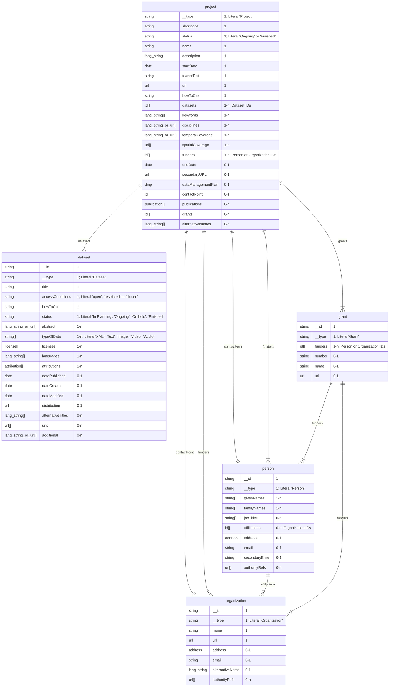

# Data Model

All metadata are modelled according to the model as described in the following.

There are two schemas for metadata: `draft` and `final`. 
Final describes the metadata as they should be in the end, 
draft has fewer constraints, in case the metadata is not yet complete. 
Any metadata of a project that is marked as `Finished` must use the final schema,
metadata of a projects that are marked as `Ongoing` may use the draft schema.

The two schemas can be found [here](https://github.com/dasch-swiss/dsp-meta/tree/main/resources).

The following description is based on the final schema.

## Top Level

A set of metadata consists of the following top-level elements:

- Project
- Dataset
- Person
- Organization
- Grant

Each of these elements is an entity identified by a unique identifier. 
Other elements can refer to these entities by their identifier.

Any other metadata element may itself be a complex object,
but it is always part of one of the top-level elements.
Such elements do not have an identifier, 
but are identified by their position in the hierarchy.

| Field           | Type           | Cardinality |
| --------------- | -------------- | ----------- |
| `$schema`       | string         | 0-1         |
| `project`       | project        | 1           |
| `datasets`      | dataset[]      | 1-n         |
| `persons`       | person[]       | 0-n         |
| `organizations` | organization[] | 0-n         |
| `grants`        | grant[]        | 0-n         |


## Types

### Entity Types

#### Project

| Field                | Type               | Cardinality | Restrictions                                                 |
| -------------------- | ------------------ | ----------- | ------------------------------------------------------------ |
| `__type`             | string             | 1           | Literal "Project"                                            |
| `shortcode`          | string             | 1           | 4 char hexadecimal                                           |
| `status`             | string             | 1           | Literal "Ongoing" or "Finished"                              |
| `name`               | string             | 1           |                                                              |
| `description`        | lang_string        | 1           |                                                              |
| `startDate`          | date               | 1           | String of format "YYYY-MM-DD"                                |
| `teaserText`         | string             | 1           |                                                              |
| `url`                | url                | 1           |                                                              |
| `howToCite`          | string             | 1           |                                                              |
| `datasets`           | id[]               | 1-n         | String containing the identifier of a dataset                |
| `keywords`           | lang_string[]      | 1-n         |                                                              |
| `disciplines`        | lang_string\|url[] | 1-n         |                                                              |
| `temporalCoverage`   | lang_string\|url[] | 1-n         |                                                              |
| `spatialCoverage`    | url[]              | 1-n         |                                                              |
| `funders`            | id[]               | 1-n         | String containing the identifier of a person or organization |
| `endDate`            | date               | 0-1         | String of format "YYYY-MM-DD"                                |
| `secondaryURL`       | url                | 0-1         |                                                              |
| `dataManagementPlan` | dmp                | 0-1         |                                                              |
| `contactPoint`       | id                 | 0-1         | String containing the identifier of a person or organization |
| `publications`       | publication[]      | 0-n         |                                                              |
| `grants`             | id[]               | 0-n         | String containing the identifier of a grant                  |
| `alternativeNames`   | lang_string[]      | 0-n         |                                                              |


#### Dataset

| Field               | Type             | Cardinality | Restrictions                                            |
| ------------------- | ---------------- | ----------- | ------------------------------------------------------- |
| `__id`              | string           | 1           |                                                         |
| `__type`            | string           | 1           | Literal "Dataset"                                       |
| `title`             | string           | 1           |                                                         |
| `accessConditions`  | string           | 1           | Literal "open", "restricted" or "closed"                |
| `howToCite`         | string           | 1           |                                                         |
| `status`            | string           | 1           | Literal "In Planning", "Ongoing", "On hold", "Finished" |
| `abstract`          | lang_string\|url | 1-n         |                                                         |
| `typeOfData`        | string[]         | 1-n         | Literal "XML", "Text", "Image", "Video", "Audio"        |
| `licenses`          | license[]        | 1-n         |                                                         |
| `languages`         | lang_string[]    | 1-n         |                                                         |
| `attributions`      | attribution[]    | 1-n         |                                                         |
| `datePublished`     | date             | 0-1         |                                                         |
| `dateCreated`       | date             | 0-1         |                                                         |
| `dateModified`      | date             | 0-1         |                                                         |
| `distribution`      | url              | 0-1         |                                                         |
| `alternativeTitles` | lang_string[]    | 0-n         |                                                         |
| `urls`              | url[]            | 0-n         |                                                         |
| `additional`        | lang_string\|url | 0-n         |                                                         |


#### Person

| Field            | Type     | Cardinality | Restrictions                           |
| ---------------- | -------- | ----------- | -------------------------------------- |
| `__id`           | string   | 1           |                                        |
| `__type`         | string   | 1           | Literal 'Person'                       |
| `givenNames`     | string[] | 1-n         |                                        |
| `familyNames`    | string[] | 1-n         |                                        |
| `jobTitles`      | string[] | 0-n         |                                        |
| `affiliations`   | id[]     | 0-n         | Organization IDs                       |
| `address`        | address  | 0-1         |                                        |
| `email`          | string   | 0-1         |                                        |
| `secondaryEmail` | string   | 0-1         |                                        |
| `authorityRefs`  | url[]    | 0-n         | References to external authority files |


#### Organization

| Field             | Type        | Cardinality | Restrictions                           |
| ----------------- | ----------- | ----------- | -------------------------------------- |
| `__id`            | string      | 1           |                                        |
| `__type`          | string      | 1           | Literal 'Organization'                 |
| `name`            | string      | 1           |                                        |
| `url`             | url         | 1           |                                        |
| `address`         | address     | 0-1         |                                        |
| `email`           | string      | 0-1         |                                        |
| `alternativeName` | lang_string | 0-1         |                                        |
| `authorityRefs`   | url[]       | 0-n         | References to external authority files |


#### Grant

| Field     | Type   | Cardinality | Restrictions               |
| --------- | ------ | ----------- | -------------------------- |
| `__id`    | string | 1           |                            |
| `__type`  | string | 1           | Literal 'Grant'            |
| `funders` | id[]   | 1-n         | Person or Organization IDs |
| `number`  | string | 0-1         |                            |
| `name`    | string | 0-1         |                            |
| `url`     | url    | 0-1         |                            |


### Value Types

#### lang_string

Object with a language tag as key and a string as value.

```json
{
    "en": "Lorem ipsum in English.",
    "de": "Lorem ipsum auf Deutsch."
}
```


#### date

String with the format `YYYY-MM-DD`.


#### url

An object representing a URL. 
Depending on the `type` field,
the URL may be a generic URL
or a more specific link, like P PID
or a reference to a resource in an external authority file.


| Field    | Type   | Cardinality | Restrictions                                                                                                                                |
| -------- | ------ | ----------- | ------------------------------------------------------------------------------------------------------------------------------------------- |
| `__type` | string | 1           | Literal 'URL'                                                                                                                               |
| `type`   | string | 1           | Literal 'URL', 'Geonames', 'Pleiades', 'Skos', 'Periodo', 'Chronontology', 'GND', 'VIAF', 'Grid', 'ORCID', 'Creative Commons', 'DOI', 'ARK' |
| `url`    | string | 1           |                                                                                                                                             |
| `text`   | string | 0-1         |                                                                                                                                             |


#### dmp (Data Management Plan)

| Field      | Type    | Cardinality | Restrictions                 |
| ---------- | ------- | ----------- | ---------------------------- |
| `__type`   | string  | 1           | Literal 'DataManagementPlan' |
| `available | boolean | 0-1         |                              |
| `url`      | url     | 0-1         |                              |


#### publication

| Field  | Type   | Cardinality | Restrictions |
| ------ | ------ | ----------- | ------------ |
| `text` | string | 1           |              |
| `url`  | url    | 0-1         |              |


#### address

| Field        | Type   | Cardinality | Restrictions      |
| ------------ | ------ | ----------- | ----------------- |
| `__type`     | string | 1           | Literal 'Address' |
| `street`     | string | 1           |                   |
| `postalCode` | string | 1           |                   |
| `locality`   | string | 1           |                   |
| `country`    | string | 1           |                   |
| `canton`     | string | 0-1         |                   |
| `additional` | string | 0-1         |                   |


#### license

| Field     | Type   | Cardinality | Restrictions      |
| --------- | ------ | ----------- | ----------------- |
| `__type`  | string | 1           | Literal 'License' |
| `license` | url    | 1           |                   |
| `date`    | date   | 1           |                   |
| `details` | string | 0-1         |                   |


#### attribution

| Field    | Type   | Cardinality | Restrictions          |
| -------- | ------ | ----------- | --------------------- |
| `__type` | string | 1           | Literal 'Attribution' |
| `agent`  | string | 1           |                       |
| `roles`  | string | 1-n         |                       |


## Entity-Relationship Diagram




## Legacy docs

The legacy documentation can be found [here](https://github.com/dasch-swiss/dsp-meta-svc/tree/main/docs/services/metadata).
This includes thoughts on mappings to external aggregators 
and on RDF representation of the metadata.


## Issues/Questions

- access conditions on datasets not current state
- status on datasets not aligned with project status
- typeOfData on datasets is a weird list of options
- does dataset need all the date fields?
