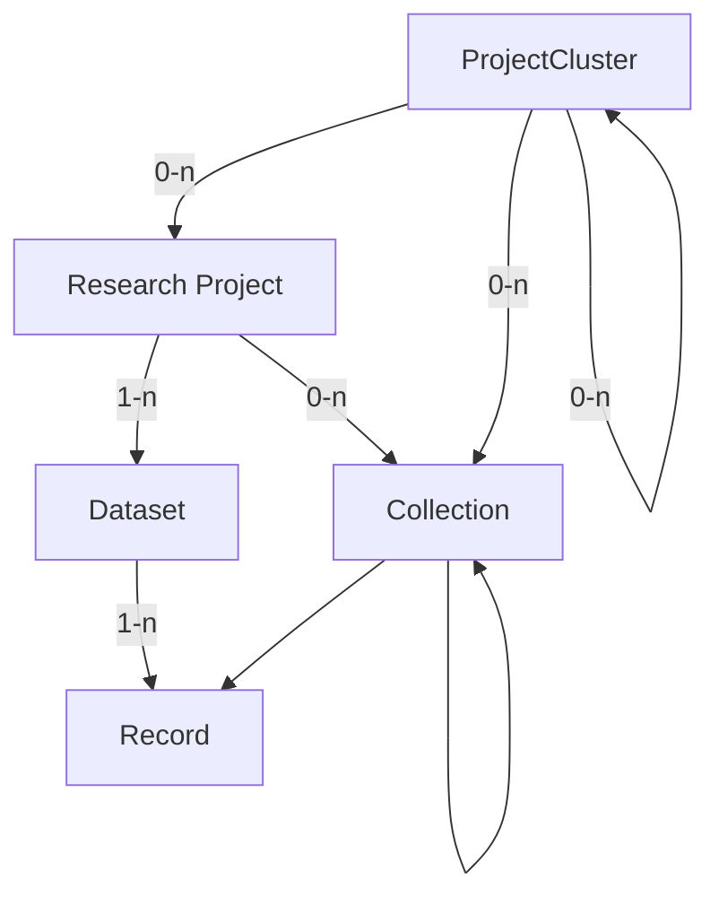

# Future Data Model

!!! warning
    This document does _not_ represent the current state of the metadata model.  
    It is a working document for planned upcoming changes to the metadata model.

!!! note
    This model is an idealized version of the metadata model.
    With the current implementation that is entirely separate from the DSP,
    it is not feasible to implement metadata on the record level.  
    Such a system may be implemented in the archive in the future,
    but for now, we will keep the metadata on the dataset level.  
    A separate, simplified model for applying some of these changes,
    while remaining compatible with the current implementation,
    should be created alongside this model.

The enhancements to the DSP metadata model are designed to better accommodate
the inherent complexity of humanities projects, while still being flexible enough to
support simpler project structures.

One of the key improvements is the introduction of an additional hierarchical level above
the research project, which we refer to as a project cluster. This allows for a more
accurate representation of overarching initiatives that span multiple research projects
over extended periods. Additionally, we have implemented collections and subcollections
to facilitate more precise referencing and organization of different parts of the data,
additionally enabling projects to retain and represent historical groupings of data.

By expanding our metadata model in this way, we aim to provide a more robust framework
that supports the integrity and longevity of humanities research data. This evolution
reflects our commitment to capturing the rich, nuanced histories of research projects
with greater accuracy and detail.

!!! note
    For each property, two cardinalities are given:

    - The archival cardinality, referring to the cardinality of the property 
    once the entity is finished/finalized for archival.  
    - The in-progress cardinality, referring to the cardinality of the property
    while the entity is still in progress.

    If only one cardinality is given, it applies to both stages.

## Overview

The metadata model is a hierarchical structure of metadata elements.



- A `Project Cluster` collects `Research Projects` or nested `Project Clusters`.  
  It is typically of institutional nature,
  not directly tied to a specific funding grant,
  and may be long-lived.  
  Examples are EKWS/CAS, BEOL or LIMC.
- A `Research Project` is the main entity of the metadata model.  
  It corresponds to a `project` in the DSP.
  It is typically tied to a specific funding grant,
  and hence has a limited lifetime of ~3-5 years;
  multiple funding rounds and a longer lifetime are possible.  
  A `Research Project` is part of 0-n `Project Clusters`,
  it has 1-n `Datasets` and 0-n `Collections`.
- A `Dataset` is a descrete segmentation of the `Records` of a `Research Project`.  
  It is a logical grouping of `Records`, and may be based on the type of data,
  or any other distinctive feature of the `Records`.
  Many projects will have only 1 `Dataset`, but multiple are possible.  
  A `Dataset` is part of exactly 1 `Research Project` and contains 1-n `Records`.
- A `Collection` is also a grouping of `Records` within a `Research Project`.  
  It is meant for semantic grouping of `Records` within a `Research Project`,
  and may have a "historical meaning" in the context of the project.  
  Examples may be physical collections such as p person's "Nachlass" in an archive,
  or groupings of records based on a specific research question within a project.  
  A `Collection` is part of at least 1 `Research Project`, `Project Cluster` or `Collection`,
  but can be part of multiple. It may either contain 0-n `Collections` or 1-n `Records`.  
  By allowing nested collections, and records to be part of multiple collections, 
  collections can be used to represent relationships or changes in the data over time.
- A `Record` is a single entry within a `Dataset`.  
  It represents a single entity, and the smallest unit that can meaningfully have an identifier.
  It maps to a `knora-base:Resource` (DSP-API) or an `Asset` (SIPI/Ingest) in the DSP.  
  A `Record` is part of exactly 1 `Dataset` and may be part of 0-n `Collections`.

Additionally, there are the entities `Person` and `Organization`:  
`Person` and `Organization` are entities that are independent of the `Research Project` hierarchy,
and may be related to various entities within the hierarchy.

## Top Level

A set of metadata consists of the following top-level elements:

- Project Cluster
- Project
- Dataset
- Collection
- Record
- Person
- Organization

Each of these elements is an entity identified by a unique identifier.
Other elements can refer to these entities by their identifier.

Any other metadata element may itself be a complex object as presented in data,
but it is always part of one of the top-level elements.
Such elements do not have an identifier,
but are identified by their position in the hierarchy.

| Field            | Type           | Archival Cardinality | In-progress Cardinality |
| ---------------- | -------------- | -------------------- | ----------------------- |
| `projectCluster` | projectCluster | 0-1                  | 0-1                     |
| `project`        | project        | 1 / 1-n              | 1 / 0-1                 |
| `datasets`       | dataset[]      | 1-n                  | 0-n                     |
| `collections`    | collection[]   | 0-n                  | 0-n                     |
| `records`        | record[]       | 1-n                  | 0-n                     |
| `persons`        | person[]       | 0-n                  | 0-n                     |
| `organizations`  | organization[] | 0-n                  | 0-n                     |

## Types

### Entity Types

#### Project Cluster

| Field              | Type          | Card. |
| ------------------ | ------------- | ----- |
| `pid`              | id            | 1     |
| `name`             | string        | 1     |
| `projects`         | id[]          | 0-n   |
| `projectClusters`  | id[]          | 0-n   |
| `description`      | lang_string   | 0-1   |
| `url`              | url           | 0-1   |
| `hotToCite`        | string        | 0-1   |
| `alternativeNames` | lang_string[] | 0-n   |
| `contactPoint`     | id[]          | 0-n   |

- `pid`: A unique persisten identifier (for now ARK URL) for the project cluster.
- `name`: The name of the project cluster.
- `projects`: A list of project identifiers that are part of the project cluster.
- `projectClusters`: A list of project cluster identifiers that are part of the project cluster, 
  in case of nested project clusters.
- `description`: The description of the project cluster.  
  String with language tag, possibly with multiple languages.
- `url`: The URL of the project cluster.
- `howToCite`: How to cite the project cluster.  
  If not provided, we use the standard form XXX.
- `alternativeNames`: Alternative names of the project cluster.
- `contactPoint`: A list of identifiers of persons or organizations responsible for the project cluster.

To make the model of this entity as flexible as possible,
most of the fields are optional.  
There is no difference in cardinality between the archival and in-progress stages.

!!! question
    What is the standard form for citing a project cluster?

#### Project

| Field                | Type                | Card. | WIP Card. |
| -------------------- | ------------------- | ----- | --------- |
| `pid`                | id                  | 1     | 1         |
| `shortcode`          | string              | 1     | 1         |
| `status`             | string              | 1     | 1         |
| `name`               | string              | 1     | 1         |
| `description`        | lang_string         | 1     | 1         |
| `startDate`          | date                | 1     | 0-1       |
| `endDate`            | date                | 1     | 0-1       |
| `teaserText`         | string              | 1     | 0-1       |
| `url`                | url                 | 1     | 0-1       |
| `howToCite`          | string              | 1     | 1         |
| `accessRights`       | accessRights        | 1     | 1         |
| `legal`              | legalMultiple       | 1     | 1         |
| `dataManagementPlan` | string / url        | 1     | 1         |
| `datasets`           | id[]                | 1-n   | 0-n       |
| `keywords`           | lang_string[]       | 1-n   | 0-n       |
| `disciplines`        | lang_string / url[] | 1-n   | 0-n       |
| `temporalCoverage`   | lang_string / url[] | 1-n   | 0-n       |
| `spatialCoverage`    | url[]               | 1-n   | 0-n       |
| `attributions`       | attribution[]       | 1-n   | 0-n       |
| `abstract`           | lang_string         | 0-1   | 0-1       |
| `secondaryURL`       | url                 | 0-1   | 0-1       |
| `contactPoint`       | id                  | 0-1   | 0-1       |
| `publications`       | publication[]       | 0-n   | 0-n       |
| `grants`             | grant[]             | 0-n   | 0-n       |
| `alternativeNames`   | lang_string[]       | 0-n   | 0-n       |

- `pid`: A unique persisten identifier (for now ARK URL) for the project.
- `shortcode`: The project's DSP short code.  
  4 characters hexadecimal, upper case.
- `status`: The status of the project.  
  Either "Ongoing" or "Finished".
- `name`: The name of the project.
- `description`: The description of the project.  
  String with language tag, possibly with multiple languages.
- `startDate`: The start date of the project.  
  Value type as defined below.
- `endData`: The end date of the project.  
  Value type as defined below.
- `teaserText`: A short text to be displayed as a teaser.  
  Maximum length: X characters.
- `url`: The URL of the project.  
  Value type as defined below.
- `howToCite`: How to cite the project.  
  If not provided, we use the standard form `name (year). [Project]. DaSCH. ARK`.
- `accessRights`: The access rights of the project.  
  Complex value type, see under "Value Types".
- `legal`: Legal information about the project.  
  Complex value type, see under "Value Types".
- `dataManagementPlan`: A data management plan of the project.
  String or URL, use "not accessible" if not available to us.
- `datasets`: A list of dataset identifiers that make up the project data.
- `keywords`: A list of keywords describing the project.  
  Strings with language tag, possibly with multiple languages per keyword.
- `disciplines`: A list of disciplines the project is related to.  
  Either strings with language tag or URLs, as defined below.
- `temporalCoverage`: A list of temporal coverages of the project.  
  Either strings with language tag or URLs, as defined below.
- `spatialCoverage`: A list of spatial coverages of the project.  
  URLs, as defined below.
- `attributions`: A list of attributions defining what roles people/organizations have in the project.  
  Manually entered, as there may be people who don't have authorship, like reviewers, organizers, etc.
  Value attribution is defined below.
- `abstract`: An abstract of the project.  
  String with language tag, possibly with multiple languages.
- `secondaryURL`: A secondary URL of the project.  
  Value type as defined below.
- `contactPoint`: A person or organization responsible for the project.
- `publications`: A list of publications related to the project.  
  Value type as defined below.
- `grants`: A list of grants related to the project.
  Value type as defined below.
- `alternativeNames`: Alternative names of the project.
  Strings with language tag, possibly with multiple languages per name.

!!! question
    Is the standard form for citing a project correct?

!!! question
    Do we still need `teaserText`?  
    Is the WIP-Cardinality correct there?
    How many characters should it have?

!!! question
    What is the difference between `url` and `pid`?  
    Is it needed if we also have `secondaryURL`?  
    What about the cardinality?

!!! question
    If we have datasets optional while in progress, and the legal stuff is computed from the records,
    it can happen that there are no records, so I guess we need to make the legal stuff optional as well.

#### Dataset

| Field          | Type          | Card. | WIP-Card |
| -------------- | ------------- | ----- | -------- |
| `pid`          | id            | 1     | 1        |
| `title`        | string        | 1     | 1        |
| `accessRights` | accessRights  | 1     | 1        |
| `legal`        | legalMultiple | 1     | 1        |
| `howToCite`    | string        | 1     | 1        |
| `typeOfData`   | string[]      | 1-n   | 0-n      |
| `dateCreated`  | date          | 1     | 0-1      |
| `dateModified` | date          | 0-1   | 0-1      |
| `records`      | id[]          | 0-n   | 0-n      |
| `description`  | lang_string   | 0-1   | 0-1      |
| `languages`    | string[]      | 1-n   | 0-n      |

- `pid`: A unique persisten identifier (for now ARK URL) for the dataset.
- `title`: The title of the dataset.
- `accessRights`: The access rights of the dataset.  
  Complex value type, see under "Value Types".
- `legal`: Legal information about the dataset.  
  Complex value type, see under "Value Types".
- `howToCite`: How to cite the dataset.  
  If not provided, we use the standard form `name (year). [Dataset]. DaSCH. ARK`.
- `typeOfData`: The type of data in the dataset.  
  Computed from the records if available and optionally added manually.
  Literal "XML", "Text", "Image", "Video", "Audio".
- `dateCreated`: The date when the dataset was created.
- `dateModified`: The date when the dataset was last modified.
- `records`: A list of record identifiers that make up the dataset.
- `description`: The description of the dataset.  
  String with language tag, possibly with multiple languages.
- `languages`: A list of languages contained in the dataset.  
  Computed from the records if available and optionally added manually.

A project can have more than one dataset if it's the project's wish and if it provides meaningful grouping of the
records e.g., 2 researchers worked one one part of the data and the 2 other researchers on the other part of the data,
EKWS digitizing different boxes and each box becomes a dataset.
A record can only be part of one dataset.

#### Collection

| Field              | Type              | Card. | WIP-Card. |
| ------------------ | ----------------- | ----- | --------- |
| `pid`              | id                | 1     | 1         |
| `name`             | string            | 1     | 1         |
| `accessRights`     | accessRights      | 1     | 1         |
| `legal`            | legalMultiple     | 1     | 1         |
| `howToCite`        | string            | 1     | 1         |
| `description`      | lang_string / url | 1-n   | 0-n       |
| `typeOfData`       | string[]          | 1-n   | 0-n       |
| `dateCreated`      | date              | 1     | 0-1       |
| `dateModified`     | date              | 0-1   | 0-1       |
| `records`          | id[]              | 0-n   | 0-n       |
| `collections`      | id[]              | 0-n   | 0-n       |
| `provenance`       | string            | 0-1   | 0-1       |
| `languages`        | lang_string[]     | 1-n   | 0-n       |
| `alternativeNames` | lang_string[]     | 0-n   | 0-n       |
| `keywords`         | lang_string[]     | 0-n   | 0-n       |
| `urls`             | url[]             | 0-n   | 0-n       |

- `pid`: A unique persisten identifier (for now ARK URL) for the collection.
- `name`: The name of the collection.
- `accessRights`: The access rights of the collection.  
  Complex value type, see under "Value Types".
- `legal`: Legal information about the collection.  
  Complex value type, see under "Value Types".
- `howToCite`: How to cite the collection.  
  If not provided, we use the standard form `name (year). [Collection]. DaSCH. ARK`.
- `description`: The description of the collection.  
  URL or String with language tag, possibly with multiple languages.
- `typeOfData`: The type of data in the collection.  
  Computed from the records if available and optionally added manually.
  Literal "XML", "Text", "Image", "Video", "Audio".
- `dateCreated`: The date when the collection was created.
- `dateModified`: The date when the collection was last modified.
- `records`: A list of record identifiers that make up the collection.
- `collections`: A list of collection identifiers that make up the collection, if nested.
- `provenance`: The provenance of the collection.
- `languages`: A list of languages contained in the collection.  
  Computed from the records if available and optionally added manually.
- `alternativeNames`: Alternative names of the collection.  
  Strings with language tag, possibly with multiple languages per name.
- `keywords`: A list of keywords describing the collection.  
  Strings with language tag, possibly with multiple languages per keyword.
- `urls`: A list of URLs related to the collection.  
  URLs, as defined below.

!!! question
    What is the standard form for citing a collection?

!!! question
    does urls here make sense?

#### Record

| Field          | Type          | Card. | WIP-Card. |
| -------------- | ------------- | ----- | --------- |
| `pid`          | id            | 1     | 1         |
| `label`        | lang_string   | 1     | 1         |
| `accessRights` | string        | 1     | 1         |
| `legal`        | legalMultiple | 1     | 1         |
| `howToCite`    | string        | 1     | 1         |
| `publisher`    | string        | 1     | 1         |
| `provenance`   | string        | 0-1   | 0-1       |
| `dateCreated`  | date          | 0-1   | 0-1       |
| `dateModified` | date          | 0-1   | 0-1       |
| `typeOfData`   | string        | 0-1   | 0-1       |
| `size`         | string        | 0-1   | 0-1       |
| `audience`     | string        | 0-n   | 0-n       |

- `pid`: A unique persisten identifier (for now ARK URL) for the record.
- `name`: The name of the record.
- `accessRights`: The access rights of the record.  
  Complex value type, see under "Value Types".
- `legal`: Legal information about the record.  
  Complex value type, see under "Value Types".
- `howToCite`: How to cite the record.  
  If not provided, we use the standard form `name (year). [Record]. DaSCH. ARK`.
- `publisher`: The publisher of the record.  
  Literal "DaSCH". Required for OpenAIRE compliance.
- `provenance`: The provenance of the record.  
  required for [openAIRE](https://openaire-guidelines-for-literature-repository-managers.readthedocs.io/en/v4.0.0/field_source.html#dc-source)
- `description`: The description of the record.  
  URL or String with language tag, possibly with multiple languages.
- `typeOfData`: The type of data in the record.  
  Literal "XML", "Text", "Image", "Video", "Audio".
- `size`: The size of the record.  
  [openAIRE Size](https://openaire-guidelines-for-literature-repository-managers.readthedocs.io/en/v4.0.0/field_size.html#dci-size)
- `audience`: The audience of the record.  
  [openAIRE Audience](https://openaire-guidelines-for-literature-repository-managers.readthedocs.io/en/v4.0.0/field_audience.html#dct-audience)  

!!! question
    What is the standard form for citing a records?

!!! question
    How do we ensure that embargo dates are consistent across the records of a dataset?
    Do they have to be? What would the implications be?

!!! question
    I have deleted `datePublished` 
    as it seems unclear what it should represent compared to `dateCreated` and `dateModified`.

!!! question
    type of data does not cover all possible types of data we could have.  
    Also, where does this information come from?

!!! question
    OpenAIRE links here point to the guidelines for literature repositories which is wrong.  
    We should have the correct links.  
    The question becomes though, if these properties then even apply to us, according to the correct guidelines.

#### Person

| Field            | Type     | Card. |
| ---------------- | -------- | ----- |
| `givenNames`     | string[] | 1-n   |
| `familyNames`    | string[] | 1-n   |
| `jobTitles`      | string[] | 0-n   |
| `affiliations`   | id[]     | 0-n   |
| `address`        | address  | 0-1   |
| `email`          | string   | 0-1   |
| `secondaryEmail` | string   | 0-1   |
| `authorityRefs`  | url[]    | 0-n   |

Cardinality is the same for both stages.

- `givenNames`: The given names of the person.  
  Multiple given names are possible.
- `familyNames`: The family names of the person.
- `jobTitles`: The job titles of the person.  
  Multiple job titles are possible.
- `affiliations`: The affiliations of the person to organizations.
- `address`: The address of the person.  
  Value type as defined below.
- `email`: The email address of the person.
- `secondaryEmail`: A secondary email address of the person.
- `authorityRefs`: References to external authority files.

!!! question
    Does job title make sense?  
    should we model functions over time,
    so that we can re-use the same person for different roles in different projects?

!!! question
    If it becomes reusable, should we model it as a separate entity with an identifier (pid/ARK).

#### Organization

| Field             | Type        | Card. |
| ----------------- | ----------- | ----- |
| `name`            | string      | 1     |
| `url`             | url         | 1     |
| `address`         | address     | 0-1   |
| `email`           | string      | 0-1   |
| `alternativeName` | lang_string | 0-1   |
| `authorityRefs`   | url[]       | 0-n   |

Cardinality is the same for both stages.

- `name`: The name of the organization.
- `url`: The URL of the organization.
- `address`: The address of the organization.  
  Value type as defined below.
- `email`: The email address of the organization.
- `alternativeName`: Alternative names of the organization.  
  Strings with language tag, possibly with multiple languages per name.
- `authorityRefs`: References to external authority files.

!!! question
    Again, should we model this over time, so that it's reuseable?

!!! question
    If it becomes reusable, should we model it as a separate entity with an identifier (pid/ARK)?

### Value Types

#### String with Language Tag (`lang_string`)

Object with an ISO language code as key and a string as value.

```json
{
  "en": "Lorem ipsum in English.",
  "de": "Lorem ipsum auf Deutsch."
}
```

#### Date

String with the format `YYYY-MM-DD`.

#### URL

An object representing a URL.
Depending on the `type` field,
the URL may be a generic URL
or a more specific link, like a PID
or a reference to a resource in an external authority file.

| Field  | Type   | Cardinality | Restrictions                                                                                                                                |
| ------ | ------ | ----------- | ------------------------------------------------------------------------------------------------------------------------------------------- |
| `type` | string | 1           | Literal 'URL', 'Geonames', 'Pleiades', 'Skos', 'Periodo', 'Chronontology', 'GND', 'VIAF', 'Grid', 'ORCID', 'Creative Commons', 'DOI', 'ARK' |
| `url`  | string | 1           |                                                                                                                                             |
| `text` | string | 0-1         |                                                                                                                                             |


#### Data Management Plan (`dmp`)

type: String ot URL, use "not accessible" if not available to us.  
long term we may provide an option to upload DMPs so they can use a URL.

<!-- TODO: make nice -->


#### Publication

| Field  | Type   | Cardinality | Restrictions |
| ------ | ------ | ----------- | ------------ |
| `text` | string | 1           |              |
| `url`  | url    | 0-1         |              |

#### Address

| Field        | Type   | Cardinality | Restrictions |
| ------------ | ------ | ----------- | ------------ |
| `street`     | string | 1           |              |
| `postalCode` | string | 1           |              |
| `locality`   | string | 1           |              |
| `country`    | string | 1           |              |
| `canton`     | string | 0-1         |              |
| `additional` | string | 0-1         |              |

#### Legal

1. License: consists `licenseText`, `licenseUri` and `licenseDate`.
2. Copright holder
3. Authorship

!!! question
    Does that make sense like this? If so, adjust everywhere.

<!-- TODO: maybe adjust everywhere else -->

from project:

| Field              | Type         | Card. | WIP Card. | Restrictions                                                         |
| ------------------ | ------------ | ----- | --------- | -------------------------------------------------------------------- |
| `licenses`         | license[]    | 1-n   | 1-n       | computed from the records if available and optionally added manually |
| `copyrightHolders` | string[]     | 1-n   | 1-n       | computed from the records if available and optionally added manually |
| `authorship`       | authorship[] | 1-n   | 1-n       | computed from the records if available and optionally added manually |
| `licenseDates`     | dateInterval | 1     | 1         | computed from recods: Interval from earliest to latest licenseDate   |

#### Attribution

Modelled according to the [OpenAIRE guidelines](https://guidelines.openaire.eu/en/latest/data/field_contributor.html).

| Field             | Type   | Cardinality | Restrictions                                  |
| ----------------- | ------ | ----------- | --------------------------------------------- |
| `contributor`     | id     | 1           | Person or Organization ID                     |
| `contributorType` | string | 1-n         | controlled vocababulary according to OpenAIRE |

#### Grant

| Field     | Type   | Cardinality | Restrictions               |
| --------- | ------ | ----------- | -------------------------- |
| `funders` | id[]   | 1-n         | Person or Organization IDs |
| `number`  | string | 0-1         |                            |
| `name`    | string | 0-1         |                            |
| `url`     | url    | 0-1         |                            |

#### Access Rights


<!-- TODO: model type for accessRights as in https://guidelines.openaire.eu/en/latest/data/field_date.html -->

<!-- TODO: naming of open, restricted, etc. -- something like "full open access", "restricted open access" etc. -->

## Open Questions

See in the text.

!!! question
    Are we happy with all WIP-Cardinalities?


