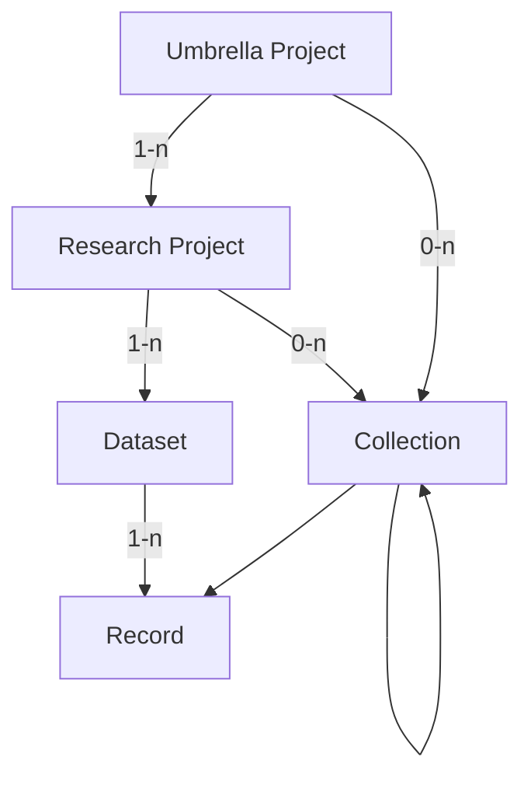
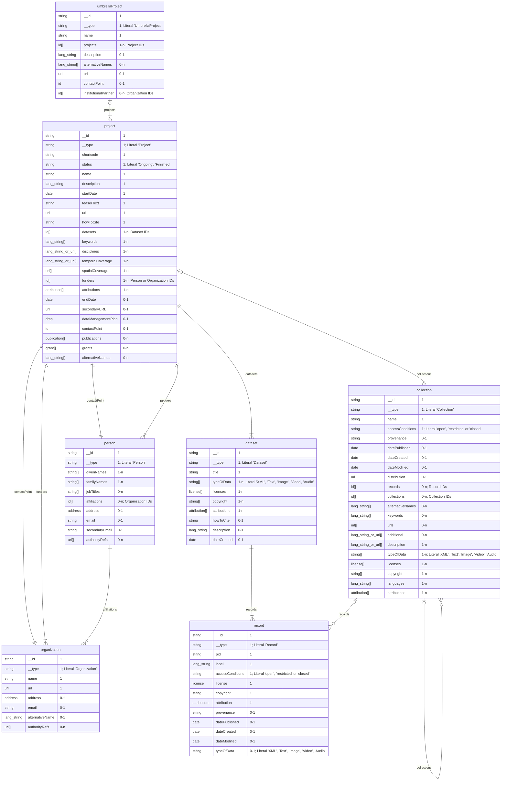

# Future Data Model

!!! warning
    This document does _not_ represent the current state of the metadata model.  
    It is a working document for planned upcoming changes to the metadata model.

!!! note
    This model is an idealized version of the metadata model.
    With the current implementation that is entirely separate from the DSP,
    it is not feasible to implement metadata on the record level.  
    Such a system may be implemented in the archive in the future,
    but for now, we will keep the metadata on the dataset level.  
    A separate, simplified model for applying some of these changes,
    while remaining compatible with the current implementation,
    should be created alongside this model.

The enhancements to the DSP metadata model are thoughtfully designed to better accommodate
the inherent complexity of humanities projects, while still being flexible enough to
support simpler project structures.

One of the key improvements is the introduction of an additional hierarchical level above
the research project, which we refer to as the umbrella project. This allows for a more
accurate representation of overarching initiatives that span multiple research projects
over extended periods. Additionally, we have implemented collections and subcollections
to facilitate more precise referencing and organization of different parts of the data,
additionally enabling projects to retain and represent historical groupings of data.

By expanding our metadata model in this way, we aim to provide a more robust framework
that supports the integrity and longevity of humanities research data. This evolution
reflects our commitment to capturing the rich, nuanced histories of research projects
with greater accuracy and detail.

## Overview

The metadata model is a hierarchical structure of metadata elements.



- A `Umbrella Project` is optional and collects one or more `Research Projects`.  
  It is typically of institutional nature,
  not directly tied to a specific funding grant,
  and may be long-lived.  
  Examples are EKWS/CAS, BEOL or LIMC.
- A `Research Project` is the main entity of the metadata model.  
  It corresponds to a `project` in the DSP.
  It is typically tied to a specific funding grant,
  and hence has a limited lifetime of ~3-5 years;
  multiple funding rounds and a longer lifetime are possible.  
  A `Research Project` is part of 0-1 `Umbrella Project`,
  it has 1-n `Datasets` and 0-n `Collections`.
- A `Dataset` is a descrete segmentation of the `Records` of a `Research Project`.  
  It is a logical grouping of `Records`, and may be based on the type of data,
  or any other distinctive feature of the `Records`.
  Many projects will have only 1 `Dataset`, but multiple are possible.  
  A `Dataset` is part of exactly 1 `Research Project` and contains 1-n `Records`.
- A `Collection` is also a grouping of `Records` within a `Research Project`.  
  It is meant for semantic grouping of `Records` within a `Research Project`,
  and may have a "historical meaning" in the context of the project.  
  Examples may be physical collections such as p person's "Nachlass" in an archive,
  or groupings of records based on a specific research question within a project.  
  A `Collection` is part of at least 1 `Research Project`, `Umbrella Project` or `Collection`,
  but can be part of multiple. It may either contain 0-n `Collections` or 1-n `Records`.  
  By allowing nested collections, and records to be part of multiple collections, 
  collections can be used to represent relationships or changes in the data over time.
- A `Record` is a single entry within a `Dataset`.  
  It represents a single entity, and the smallest unit that can meaningfully have an identifier.
  It maps to a `knora-base:Resource` (DSP-API) or an `Asset` (SIPI/Ingest) in the DSP.  
  A `Record` is part of exactly 1 `Dataset` and may be part of 0-n `Collections`.

Additionally, there are the entities `Person` and `Organization`:  
`Person` and `Organization` are entities that are independent of the `Research Project` hierarchy,
and may be related to various entities within the hierarchy.

## Top Level

A set of metadata consists of the following top-level elements:

- Umbrella Project
- Project
- Dataset
- Collection
- Record
- Person
- Organization

Each of these elements is an entity identified by a unique identifier.
Other elements can refer to these entities by their identifier.

Any other metadata element may itself be a complex object,
but it is always part of one of the top-level elements.
Such elements do not have an identifier,
but are identified by their position in the hierarchy.

| Field             | Type            | Cardinality |
| ----------------- | --------------- | ----------- |
| `$schema`         | string          | 0-1         |
| `umbrellaProject` | umbrellaProject | 0-1         |
| `project`         | project         | 1           |
| `datasets`        | dataset[]       | 1-n         |
| `collections`     | collection[]    | 0-n         |
| `records`         | record[]        | 0-n         |
| `persons`         | person[]        | 0-n         |
| `organizations`   | organization[]  | 0-n         |


## Types

### Entity Types

#### Umbrella Project

| Field              | Type          | Card. | Restrictions                                                   |
| ------------------ | ------------- | ----- | -------------------------------------------------------------- |
| `__id`             | string        | 1     |                                                                |
| `__type`           | string        | 1     | Literal 'UmbrellaProject'                                      |
| `pid`              | id            | 1     |                                                                |
| `name`             | string        | 1     |                                                                |
| `projects`         | id[]          | 1-n   | String containing the identifier of a project                  |
| `description`      | lang_string   | 0-1   |                                                                |
| `url`              | url           | 0-1   |                                                                |
| `alternativeNames` | lang_string[] | 0-n   |                                                                |
| `contactPoint`     | id[]          | 0-n   | Strings containing the identifiers of a person or organization |

!!! question
    This opens up the questions of how to deal with multiple projects in a umbrella project.
    We probably want to keep one entry per project,
    so this leaves us with either duplicating the umbrella project metadata for each project,
    or having umbrella project metadata separately and only linking it from the project.
    The latter seems preferable,
    but then the question arises who gets to edit the umbrella project metadata.  
    For a first implementation, we could simply duplicate the metadata for each project,
    and later factor it out.

!!! question
    do we need `howToCite` for the umbrella project?

To make the model of this entity as flexible as possible,
most of the fields are optional.

#### Project

| Field                | Type                | Cardinality | Restrictions                                                                                                                                             |
| -------------------- | ------------------- | ----------- | -------------------------------------------------------------------------------------------------------------------------------------------------------- |
| `__type`             | string              | 1           | Literal "Project"                                                                                                                                        |
| `pid`                | id                  | 1           |                                                                                                                                                          |
| `shortcode`          | string              | 1           | 4 char hexadecimal                                                                                                                                       |
| `status`             | string              | 1           | Literal "Ongoing" or "Finished"                                                                                                                          |
| `name`               | string              | 1           |                                                                                                                                                          |
| `description`        | lang_string         | 1           |                                                                                                                                                          |
| `startDate`          | date                | 1           | String of format "YYYY-MM-DD"                                                                                                                            |
| `teaserText`         | string              | 1           |                                                                                                                                                          |
| `url`                | url                 | 1           |                                                                                                                                                          |
| `howToCite`          | string              | 1           |                                                                                                                                                          |
| `permissions`        | string              | 1           | Literal "open", "restricted", "embargo" or "metadata only", according to [COAR Access Rights](https://vocabularies.coar-repositories.org/access_rights/) |
| `datasets`           | id[]                | 1-n         | String containing the identifier of a dataset                                                                                                            |
| `keywords`           | lang_string[]       | 1-n         |                                                                                                                                                          |
| `disciplines`        | lang_string / url[] | 1-n         |                                                                                                                                                          |
| `temporalCoverage`   | lang_string / url[] | 1-n         |                                                                                                                                                          |
| `spatialCoverage`    | url[]               | 1-n         |                                                                                                                                                          |
| `attributions`       | attribution[]       | 1-n         | computed from the records if available and optionally added manually                                                                                     |
| `licenses`           | license[]           | 1-n         | computed from the records if available and optionally added manually                                                                                     |
| `copyright`          | string[]            | 1-n         | computed from the records if available and optionally added manually                                                                                     |
| `abstract`           | lang_string         | 0-1         |                                                                                                                                                          |
| `endDate`            | date                | 0-1         | String of format "YYYY-MM-DD"                                                                                                                            |
| `secondaryURL`       | url                 | 0-1         |                                                                                                                                                          |
| `dataManagementPlan` | dmp                 | 0-1         |                                                                                                                                                          |
| `contactPoint`       | id                  | 0-1         | String containing the identifier of a person or organization                                                                                             |
| `publications`       | publication[]       | 0-n         |                                                                                                                                                          |
| `grants`             | grant[]             | 0-n         |                                                                                                                                                          |
| `alternativeNames`   | lang_string[]       | 0-n         |                                                                                                                                                          |

!!! question
    Do permissions need to be a complex object?
    Embargo probably needs the date when it ends.


#### Dataset

| Field          | Type          | Cardinality | Restrictions                                     | Remarks                                                              |
| -------------- | ------------- | ----------- | ------------------------------------------------ | -------------------------------------------------------------------- |
| `__id`         | string        | 1           |                                                  |                                                                      |
| `__type`       | string        | 1           | Literal "Dataset"                                |                                                                      |
| `pid`          | id            | 1           |                                                  |                                                                      |
| `title`        | string        | 1           |                                                  |                                                                      |
| `typeOfData`   | string[]      | 1-n         | Literal "XML", "Text", "Image", "Video", "Audio" | computed from the records if available and optionally added manually |
| `licenses`     | license[]     | 1-n         |                                                  | computed from the records if available and optionally added manually |
| `copyright`    | string[]      | 1-n         |                                                  | computed from the records if available and optionally added manually |
| `attributions` | attribution[] | 1-n         |                                                  | computed from the records if available and optionally added manually |
| `howToCite`    | string        | 0-1         |                                                  | A generated field along with the ARK.                                |
| `description`  | lang_string   | 0-1         |                                                  |                                                                      |
| `dateCreated`  | date          | 0-1         |                                                  |                                                                      |

!!! question
    If `howToCite` is generated, should the cardinality be 1?

!!! question
    In the old model, we had `languages` on the dataset level. Do we still need this?


!!! question
    In the long term, do we need a reference to the records in the dataset? (Not for now.)

!!! question
    Does `dateCreated` suffice here? There were more date properties in the old model.

!!! answer
    What is the meaning of `dateCreated` in this context?

A project can have more than one dataset if it's the project's wish and if it provides meaningful grouping of the
records e.g., 2 researchers worked one one part of the data and the 2 other researchers on the other part of the data,
EKWS digitizing different boxes and each box becomes a dataset.
A record can only be part of one dataset.

#### Collection

| Field              | Type              | Cardinality | Restrictions                                     | Remarks                                                                                                                                         |
| ------------------ | ----------------- | ----------- | ------------------------------------------------ | ----------------------------------------------------------------------------------------------------------------------------------------------- |
| `__id`             | string            | 1           |                                                  |                                                                                                                                                 |
| `__type`           | string            | 1           | Literal 'Collection'                             |                                                                                                                                                 |
| `pid`              | id                | 1           |                                                  |                                                                                                                                                 |
| `name`             | string            | 1           |                                                  |                                                                                                                                                 |
| `description`      | string / url      | 1-n         |                                                  |                                                                                                                                                 |
| `typeOfData`       | string[]          | 1-n         | Literal "XML", "Text", "Image", "Video", "Audio" | copied from dataset; does this still make sense? -> Maybe not.  -> should it be optional? or removed?                                           |
| `licenses`         | license[]         | 1-n         |                                                  | computed from the records if available and optionally added manually                                                                            |
| `copyright`        | string[]          | 1-n         |                                                  | computed from the records if available and optionally added manually                                                                            |
| `languages`        | lang_string[]     | 1-n         |                                                  | copied from dataset; does this make sense? -> computed if available and optionally added manually.   -> ?                                       |
| `attributions`     | attribution[]     | 1-n         |                                                  | computed from the records if available and optionally added manually                                                                            |
| `provenance`       | string            | 0-1         |                                                  | see: [openAIRE Guidelines](https://openaire-guidelines-for-literature-repository-managers.readthedocs.io/en/v4.0.0/field_source.html#dc-source) |
| `records`          | id[]              | 0-n         | Record IDs                                       | can be 0 in case it points to a collection                                                                                                      |
| `collections`      | id[]              | 0-n         | Collection IDs                                   |                                                                                                                                                 |
| `alternativeNames` | lang_string[]     | 0-n         |                                                  |                                                                                                                                                 |
| `keywords`         | lang_string[]     | 0-n         |                                                  | does this make sense? -> Interesting for the search.                                                                                            |
| `urls`             | url[]             | 0-n         |                                                  | copied from dataset;                                                                                                                            |
| `additional`       | lang_string / url | 0-n         |                                                  | copied from dataset;  -> Probably not needed.                                                                                                   |

!!! note
    In the long term (not for now), we need to reference the records in the collection.

!!! question
    Is it correct, that collections are completely unuseable, as long as we don't have metadata on the record level?

#### Record

| Field               | Type        | Cardinality | Restrictions                                     | Remarks                                                                                                                                                                                                                                                    |
| ------------------- | ----------- | ----------- | ------------------------------------------------ | ---------------------------------------------------------------------------------------------------------------------------------------------------------------------------------------------------------------------------------------------------------- |
| `__id`              | string      | 1           |                                                  |                                                                                                                                                                                                                                                            |
| `__type`            | string      | 1           | Literal 'Record'                                 |                                                                                                                                                                                                                                                            |
| `pid`               | id          | 1           |                                                  | or `ARK`? -> probably use `pid`                                                                                                                                                                                                                            |
| `label`             | lang_string | 1           |                                                  | do we want this, or does it go too far? -> We want to keep it because it's the "name" of the record. But we can think about renaming it.                                                                                                                   |
| `accessConditions`  | string      | 1           | Literal "open", "restricted" or "closed"         | copied from dataset; change to proper terms -> open, restricted, embargoed, metadata-only and renaming  `accessConditions` to `rights` to be in line with openAIRE.                                                                                        |
| `embargoPeriodDate` | date        | 0-1         |                                                  | -> needs to be added to be in line with openAIRE, e.g., ```<datacite:dates> <datacite:date dateType="Accepted">2011-12-01</datacite:date> <datacite:date dateType="Available">2012-12-01</datacite:date> </datacite:dates>```                              |
| `publisher`         | string      | 1           |                                                  | should be DaSCH                                                                                                                                                                                                                                            |
| `license`           | license     | 1           |                                                  | copied from dataset; should be computed from the records -> No, you have to indicate the license here. Computation is not possible.                                                                                                                        |
| `copyright`         | string      | 1           |                                                  | computed along with license -> -> No, you have to indicate the copyright here. Computation is not possible.                                                                                                                                                |
| `attribution`       | attribution | 1           |                                                  | do we want this, or does it go too far? -> Yes                                                                                                                                                                                                             |
| `provenance`        | string      | 0-1         |                                                  | do we want this, or does it go too far? -> Yes, [openAIRE data-source](https://openaire-guidelines-for-literature-repository-managers.readthedocs.io/en/v4.0.0/field_source.html#dc-source)                                                                |
| `datePublished`     | date        | 0-1         |                                                  | copied from dataset; do they make sense? -> Yes                                                                                                                                                                                                            |
| `dateCreated`       | date        | 0-1         |                                                  | copied from dataset; do they make sense?  -> Yes                                                                                                                                                                                                           |
| `dateModified`      | date        | 0-1         |                                                  | copied from dataset; do they make sense?   -> Yes                                                                                                                                                                                                          |
| `typeOfData`        | string      | 0-1         | Literal "XML", "Text", "Image", "Video", "Audio" | copied from dataset; wanted? what values?    -> Yes, type is computed and should represent: [openAIRE Resource Type](https://openaire-guidelines-for-literature-repository-managers.readthedocs.io/en/v4.0.0/field_publicationtype.html#aire-resourcetype) |
| `size`              | string      | 0-1         |                                                  | needs to be added, see: [openAIRE Size](https://openaire-guidelines-for-literature-repository-managers.readthedocs.io/en/v4.0.0/field_size.html#dci-size)                                                                                                  |
| `audience`          | string      | 0-n         |                                                  | needs to be added, see: [openAIRE Audience](https://openaire-guidelines-for-literature-repository-managers.readthedocs.io/en/v4.0.0/field_audience.html#dct-audience)                                                                                      |

!!! question
How granular do we want to be with the metadata on the record level?

!!! answer
We need provenance,
see: [openAIRE Source](https://openaire-guidelines-for-literature-repository-managers.readthedocs.io/en/v4.0.0/field_source.html#dc-source)

!!! question
If we have copyright, what is the purpose of attribution?

!!! answer
Copyright doesn't have anything to do with attribution. Attribution is who did something with the data. Copyright is
person/organization who holds the right to this record and can give others the permission to do something with this
record aka license.

#### Person

| Field            | Type     | Cardinality | Restrictions                           | Remarks |
| ---------------- | -------- | ----------- | -------------------------------------- | ------- |
| `__id`           | string   | 1           |                                        |         |
| `__type`         | string   | 1           | Literal 'Person'                       |         |
| `givenNames`     | string[] | 1-n         |                                        |         |
| `familyNames`    | string[] | 1-n         |                                        |         |
| `jobTitles`      | string[] | 0-n         |                                        |         |
| `affiliations`   | id[]     | 0-n         | Organization IDs                       |         |
| `address`        | address  | 0-1         |                                        |         |
| `email`          | string   | 0-1         |                                        |         |
| `secondaryEmail` | string   | 0-1         |                                        |         |
| `authorityRefs`  | url[]    | 0-n         | References to external authority files |         |

#### Organization

| Field             | Type        | Cardinality | Restrictions                           | Remarks |
| ----------------- | ----------- | ----------- | -------------------------------------- | ------- |
| `__id`            | string      | 1           |                                        |         |
| `__type`          | string      | 1           | Literal 'Organization'                 |         |
| `name`            | string      | 1           |                                        |         |
| `url`             | url         | 1           |                                        |         |
| `address`         | address     | 0-1         |                                        |         |
| `email`           | string      | 0-1         |                                        |         |
| `alternativeName` | lang_string | 0-1         |                                        |         |
| `authorityRefs`   | url[]       | 0-n         | References to external authority files |         |

### Value Types

#### String with Language Tag (`lang_string`)

Object with an ISO language code as key and a string as value.

```json
{
  "en": "Lorem ipsum in English.",
  "de": "Lorem ipsum auf Deutsch."
}
```

#### Date

String with the format `YYYY-MM-DD`.

#### URL

An object representing a URL.
Depending on the `type` field,
the URL may be a generic URL
or a more specific link, like a PID
or a reference to a resource in an external authority file.

| Field    | Type   | Cardinality | Restrictions                                                                                                                                |
| -------- | ------ | ----------- | ------------------------------------------------------------------------------------------------------------------------------------------- |
| `__type` | string | 1           | Literal 'URL'                                                                                                                               |
| `type`   | string | 1           | Literal 'URL', 'Geonames', 'Pleiades', 'Skos', 'Periodo', 'Chronontology', 'GND', 'VIAF', 'Grid', 'ORCID', 'Creative Commons', 'DOI', 'ARK' |
| `url`    | string | 1           |                                                                                                                                             |
| `text`   | string | 0-1         |                                                                                                                                             |

!!! question
can we model different types of URLs in a more sensible way?

!!! answer
In the mid-term we should untangle this mess of URLs, ARKs, Geonames etc.

#### Data Management Plan (`dmp`)

| Field       | Type    | Cardinality | Restrictions                 |
| ----------- | ------- | ----------- | ---------------------------- |
| `__type`    | string  | 1           | Literal 'DataManagementPlan' |
| `available` | boolean | 0-1         |                              |
| `url`       | url     | 0-1         |                              |

!!! question
Does the model for `Data Management Plan` still make sense?
Could it be a string?
Is "available" useful information?
How do we ensure that either `available` or `url` is set?

!!! answer
If we cannot upload the DMP or provide a reference to a published, then we don't need this.

#### Publication

| Field  | Type   | Cardinality | Restrictions |
| ------ | ------ | ----------- | ------------ |
| `text` | string | 1           |              |
| `url`  | url    | 0-1         |              |

#### Address

| Field        | Type   | Cardinality | Restrictions      |
| ------------ | ------ | ----------- | ----------------- |
| `__type`     | string | 1           | Literal 'Address' |
| `street`     | string | 1           |                   |
| `postalCode` | string | 1           |                   |
| `locality`   | string | 1           |                   |
| `country`    | string | 1           |                   |
| `canton`     | string | 0-1         |                   |
| `additional` | string | 0-1         |                   |

#### License

| Field     | Type   | Cardinality | Restrictions      |
| --------- | ------ | ----------- | ----------------- |
| `__type`  | string | 1           | Literal 'License' |
| `license` | url    | 1           |                   |
| `date`    | date   | 1           |                   |
| `details` | string | 0-1         |                   |

!!! question
Is this model up to date with our current understanding of licenses?
Is `details` ever used?
What is the purpose of `date` here?
How does it relate to a copyright statement?

!!! answer
License are depending on dates. It doesn't relate to a copyright statement.

#### Attribution

| Field    | Type   | Cardinality | Restrictions              | Remark                            |
| -------- | ------ | ----------- | ------------------------- | --------------------------------- |
| `__type` | string | 1           | Literal 'Attribution'     |                                   |
| `agent`  | id     | 1           | Person or Organization ID | Or can this only be person? -> No |
| `roles`  | string | 1-n         |                           |                                   |

#### Grant

| Field     | Type   | Cardinality | Restrictions               |
| --------- | ------ | ----------- | -------------------------- |
| `__type`  | string | 1           | Literal 'Grant'            |
| `funders` | id[]   | 1-n         | Person or Organization IDs |
| `number`  | string | 0-1         |                            |
| `name`    | string | 0-1         |                            |
| `url`     | url    | 0-1         |                            |

## Entity-Relationship Diagram



## Notes

- [ ] Permissions: open, restricted, embargo, metadata only
<!-- !!! question
    Do we consider "permissions" as metadata?  
    (Not as they are in the DSP, but as they will be in the archive;
    that is: "open", "restricted", "embargo", "metadata only".)  
    If so, this should be added on each level, I suppose.

!!! answer
    Yes, as COAR indicates, [COAR Access Rights](https://vocabularies.coar-repositories.org/access_rights/) -->
- [ ] ...

## Change Log

- Make `Grant` a value type and remove it from the top level.
- Added entity `umbrellaProject` to the top level.
- Added entity `collection` to the top level.
- Added entity `record` to the top level.
- Added `pid` to `project`.
- Added `attributions` to `project`.
- Added `licenses` to `project`.
- Added `copyright` to `project`.
- Added `abstract` to `project`.
- Added `copyright` to `dataset`.
- Changed type of `abstract`/`description` in `dataset` to `lang_string`.
- Changed cardinality of `abstract`/`description` in `dataset` to 1.
- Changed cardinality of `howToCite` in `dataset` to 0-1.
- Changed cardinality of `description` in `dataset` to 0-1.
- Removed `funders` from `project`.
- Removed `accessConditions` from `dataset`.
- Removed `status` from `dataset`.
- Renamed `abstract` to `description` in `dataset`.
- Removed `languages` from `dataset`. (?)
- Removed `datePublished`, and `dateModified` from `dataset`.
- Removed `distribution` from `dataset`.
- Removed `additional` from `dataset`.
- Removed `alternativeTitles` from `dataset`.
- Removed `urls` from `dataset`.
