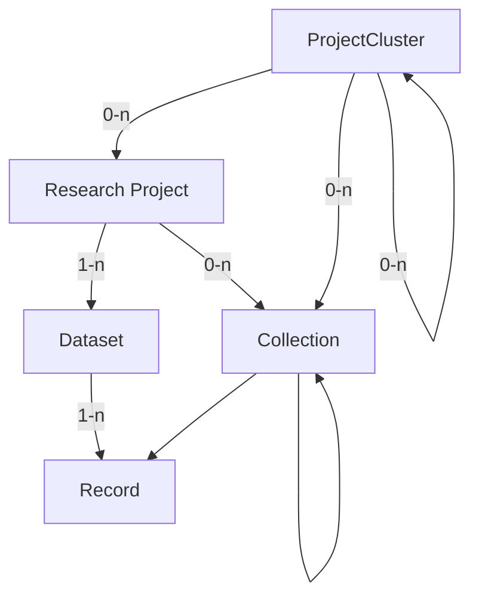

# Future Data Model

!!! warning
    This document does _not_ represent the current state of the metadata model.  
    It is a working document for planned upcoming changes to the metadata model.

!!! note
    This model is an idealized version of the metadata model.
    With the current implementation that is entirely separate from the DSP,
    it is not feasible to implement metadata on the record level.  
    Such a system may be implemented in the archive in the future,
    but for now, we will keep the metadata on the dataset level.  
    A separate, simplified model for applying some of these changes,
    while remaining compatible with the current implementation,
    should be created alongside this model.

The enhancements to the DSP metadata model are thoughtfully designed to better accommodate
the inherent complexity of humanities projects, while still being flexible enough to
support simpler project structures.

One of the key improvements is the introduction of an additional hierarchical level above
the research project, which we refer to as a project cluster. This allows for a more
accurate representation of overarching initiatives that span multiple research projects
over extended periods. Additionally, we have implemented collections and subcollections
to facilitate more precise referencing and organization of different parts of the data,
additionally enabling projects to retain and represent historical groupings of data.

By expanding our metadata model in this way, we aim to provide a more robust framework
that supports the integrity and longevity of humanities research data. This evolution
reflects our commitment to capturing the rich, nuanced histories of research projects
with greater accuracy and detail.

!!! note
    For each property, two cardinalities are given:

    - The archival cardinality, referring to the cardinality of the property 
    once the entity is finished/finalized for archival.  
    - The in-progress cardinality, referring to the cardinality of the property
    while the entity is still in progress.

    If only one cardinality is given, it applies to both stages.

## Overview

The metadata model is a hierarchical structure of metadata elements.



- A `Project Cluster` collects `Research Projects` or nested `Project Clusters`.  
  It is typically of institutional nature,
  not directly tied to a specific funding grant,
  and may be long-lived.  
  Examples are EKWS/CAS, BEOL or LIMC.
- A `Research Project` is the main entity of the metadata model.  
  It corresponds to a `project` in the DSP.
  It is typically tied to a specific funding grant,
  and hence has a limited lifetime of ~3-5 years;
  multiple funding rounds and a longer lifetime are possible.  
  A `Research Project` is part of 0-n `Project Clusters`,
  it has 1-n `Datasets` and 0-n `Collections`.
- A `Dataset` is a descrete segmentation of the `Records` of a `Research Project`.  
  It is a logical grouping of `Records`, and may be based on the type of data,
  or any other distinctive feature of the `Records`.
  Many projects will have only 1 `Dataset`, but multiple are possible.  
  A `Dataset` is part of exactly 1 `Research Project` and contains 1-n `Records`.
- A `Collection` is also a grouping of `Records` within a `Research Project`.  
  It is meant for semantic grouping of `Records` within a `Research Project`,
  and may have a "historical meaning" in the context of the project.  
  Examples may be physical collections such as p person's "Nachlass" in an archive,
  or groupings of records based on a specific research question within a project.  
  A `Collection` is part of at least 1 `Research Project`, `Project Cluster` or `Collection`,
  but can be part of multiple. It may either contain 0-n `Collections` or 1-n `Records`.  
  By allowing nested collections, and records to be part of multiple collections, 
  collections can be used to represent relationships or changes in the data over time.
- A `Record` is a single entry within a `Dataset`.  
  It represents a single entity, and the smallest unit that can meaningfully have an identifier.
  It maps to a `knora-base:Resource` (DSP-API) or an `Asset` (SIPI/Ingest) in the DSP.  
  A `Record` is part of exactly 1 `Dataset` and may be part of 0-n `Collections`.

Additionally, there are the entities `Person` and `Organization`:  
`Person` and `Organization` are entities that are independent of the `Research Project` hierarchy,
and may be related to various entities within the hierarchy.

## Top Level

A set of metadata consists of the following top-level elements:

- Project Cluster
- Project
- Dataset
- Collection
- Record
- Person
- Organization

Each of these elements is an entity identified by a unique identifier.
Other elements can refer to these entities by their identifier.

Any other metadata element may itself be a complex object as presented in data,
but it is always part of one of the top-level elements.
Such elements do not have an identifier,
but are identified by their position in the hierarchy.

| Field            | Type           | Archival Cardinality | In-progress Cardinality |
| ---------------- | -------------- | -------------------- | ----------------------- |
| `projectCluster` | projectCluster | 0-1                  | 0-1                     |
| `project`        | project        | 1 / 1-n              | 1 / 0-1                 |
| `datasets`       | dataset[]      | 1-n                  | 0-n                     |
| `collections`    | collection[]   | 0-n                  | 0-n                     |
| `records`        | record[]       | 1-n                  | 0-n                     |
| `persons`        | person[]       | 0-n                  | 0-n                     |
| `organizations`  | organization[] | 0-n                  | 0-n                     |

## Types

### Entity Types

#### Project Cluster

| Field              | Type          | Card. | Restrictions                                                   |
| ------------------ | ------------- | ----- | -------------------------------------------------------------- |
| `pid`              | id            | 1     |                                                                |
| `name`             | string        | 1     |                                                                |
| `projects`         | id[]          | 0-n   | String containing the identifier of a project                  |
| `projectClusters`  | id[]          | 0-n   | String containing the identifier of a project cluster          |
| `description`      | lang_string   | 0-1   |                                                                |
| `url`              | url           | 0-1   |                                                                |
| `hotToCite`        | string        | 0-1   |                                                                |
| `alternativeNames` | lang_string[] | 0-n   |                                                                |
| `contactPoint`     | id[]          | 0-n   | Strings containing the identifiers of a person or organization |

To make the model of this entity as flexible as possible,
most of the fields are optional.  
There is no difference in cardinality between the archival and in-progress stages.

#### Project

| Field                | Type                | Card. | WIP Card. | Restrictions                                                                                                                                               |
| -------------------- | ------------------- | ----- | --------- | ---------------------------------------------------------------------------------------------------------------------------------------------------------- |
| `pid`                | id                  | 1     | 1         |                                                                                                                                                            |
| `shortcode`          | string              | 1     | 1         | 4 char hexadecimal                                                                                                                                         |
| `status`             | string              | 1     | 1         | Literal "Ongoing" or "Finished"                                                                                                                            |
| `name`               | string              | 1     | 1         |                                                                                                                                                            |
| `description`        | lang_string         | 1     | 1         |                                                                                                                                                            |
| `startDate`          | date                | 1     | 1         | String of format "YYYY-MM-DD"                                                                                                                              |
| `teaserText`         | string              | 1     | 1         |                                                                                                                                                            |
| `url`                | url                 | 1     | 1         |                                                                                                                                                            |
| `howToCite`          | string              | 1     | 1         |                                                                                                                                                            |
| `accessRights`       | accessRights        | 1     | 1         | Literal "open", "restricted", "embargoed" or "metadata only", according to [COAR Access Rights](https://vocabularies.coar-repositories.org/access_rights/) |
| `datasets`           | id[]                | 1-n   | 0-n       | String containing the identifier of a dataset                                                                                                              |
| `keywords`           | lang_string[]       | 1-n   | 0-n       |                                                                                                                                                            |
| `disciplines`        | lang_string / url[] | 1-n   | 0-n       |                                                                                                                                                            |
| `temporalCoverage`   | lang_string / url[] | 1-n   | 0-n       |                                                                                                                                                            |
| `spatialCoverage`    | url[]               | 1-n   | 0-n       |                                                                                                                                                            |
| `attributions`       | attribution[]       | 1-n   | 0-n       | manually entered (e.g. also people who don't have authorship, like reviewers, organizers, etc.)                                                            |
| `licenses`           | license[]           | 1-n   | 1-n       | computed from the records if available and optionally added manually                                                                                       |
| `copyrightHolders`   | string[]            | 1-n   | 1-n       | computed from the records if available and optionally added manually                                                                                       |
| `authorship`         | authorship[]        | 1-n   | 1-n       | computed from the records if available and optionally added manually                                                                                       |
| `licenseDates`       | dateInterval        | 1     | 1         | computed from recods: Interval from earliest to latest licenseDate                                                                                         |
| `abstract`           | lang_string         | 0-1   | 0-1       |                                                                                                                                                            |
| `endDate`            | date                | 0-1   | 0-1       | String of format "YYYY-MM-DD"                                                                                                                              |
| `secondaryURL`       | url                 | 0-1   | 0-1       |                                                                                                                                                            |
| `dataManagementPlan` | dmp                 | 0-1   | 0-1       |                                                                                                                                                            |
| `contactPoint`       | id                  | 0-1   | 0-1       | String containing the identifier of a person or organization                                                                                               |
| `publications`       | publication[]       | 0-n   | 0-n       |                                                                                                                                                            |
| `grants`             | grant[]             | 0-n   | 0-n       |                                                                                                                                                            |
| `alternativeNames`   | lang_string[]       | 0-n   | 0-n       |                                                                                                                                                            |

!!! danger
    Do we still need `teaserText`?  
    Is the WIP-Cardinality correct there?

!!! danger
    What is the difference between `url` and `pid`?  
    Is it needed if we also have `secondaryURL`?  
    What about the cardinality?

!!! danger
    If we have datasets optional while in progress, and the legal stuff is computed from the records,
    it can happen that there are no records, so I guess we need to make the legal stuff optional as well.

<!-- TODO: model type for accessRights as in https://guidelines.openaire.eu/en/latest/data/field_date.html -->

<!-- TODO: unify tables (cols) -->

#### Dataset

| Field              | Type         | Card. | WIP-Card | Restrictions                                                                                                                                               | Remarks                                                                                          |
| ------------------ | ------------ | ----- | -------- | ---------------------------------------------------------------------------------------------------------------------------------------------------------- | ------------------------------------------------------------------------------------------------ |
| `pid`              | id           | 1     | 1        |                                                                                                                                                            |                                                                                                  |
| `title`            | string       | 1     | 1        |                                                                                                                                                            |                                                                                                  |
| `accessRights`     | accessRights | 1     | 1        | Literal "open", "restricted", "embargoed" or "metadata only", according to [COAR Access Rights](https://vocabularies.coar-repositories.org/access_rights/) |                                                                                                  |
| `typeOfData`       | string[]     | 1-n   | 0-n      | Literal "XML", "Text", "Image", "Video", "Audio"                                                                                                           | computed from the records if available and optionally added manually                             |
| `licenses`         | license[]    | 1-n   | 1-n      |                                                                                                                                                            | computed from the records if available and optionally added manually                             |
| `copyrightHolders` | string[]     | 1-n   | 1-n      |                                                                                                                                                            | computed from the records if available and optionally added manually                             |
| `authorship`       | authorship[] | 1-n   | 1-n      |                                                                                                                                                            | computed from the records if available and optionally added manually                             |
| `licenseDates`     | dateInterval | 1     | 1        |                                                                                                                                                            | Computed from recods: Interval from earliest to latest licenseDate                               |
| `howToCite`        | string       | 1     | 1        |                                                                                                                                                            | A generated field along with the ARK.                                                            |
| `description`      | lang_string  | 0-1   | 0-1      |                                                                                                                                                            |                                                                                                  |
| `dateCreated`      | date         | 0-1   | 0-1      |                                                                                                                                                            | Date when the dataset was created; may coincide with the creation of the first record.           |
| `dateModified`     | date         | 0-1   | 0-1      |                                                                                                                                                            | Date when the dataset was last modified; should coincide with the last modification of a record. |
| `records`          | id[]         | 0-n   | 0-n      | Record IDs                                                                                                                                                 |                                                                                                  |
| `languages`        | string[]     | 1-n   | 0-n      |                                                                                                                                                            |                                                                                                  |

A project can have more than one dataset if it's the project's wish and if it provides meaningful grouping of the
records e.g., 2 researchers worked one one part of the data and the 2 other researchers on the other part of the data,
EKWS digitizing different boxes and each box becomes a dataset.
A record can only be part of one dataset.

#### Collection

| Field              | Type          | Card. | WIP-Card. | Restrictions                                                                                                                                               | Remarks                                                                                                                                         |
| ------------------ | ------------- | ----- | --------- | ---------------------------------------------------------------------------------------------------------------------------------------------------------- | ----------------------------------------------------------------------------------------------------------------------------------------------- |
| `pid`              | id            | 1     | 1         |                                                                                                                                                            |                                                                                                                                                 |
| `name`             | string        | 1     | 1         |                                                                                                                                                            |                                                                                                                                                 |
| `accessRights`     | accessRights  | 1     | 1         | Literal "open", "restricted", "embargoed" or "metadata only", according to [COAR Access Rights](https://vocabularies.coar-repositories.org/access_rights/) |                                                                                                                                                 |
| `description`      | string / url  | 1-n   | 0-n       |                                                                                                                                                            |                                                                                                                                                 |
| `typeOfData`       | string[]      | 1-n   | 0-n       | Literal "XML", "Text", "Image", "Video", "Audio"                                                                                                           | copied from dataset; does this still make sense? -> Maybe not.  -> should it be optional? or removed?                                           |
| `languages`        | lang_string[] | 1-n   | 0-n       |                                                                                                                                                            | copied from dataset; does this make sense? -> computed if available and optionally added manually.   -> ?                                       |
| `licenses`         | license[]     | 1-n   | 1-n       |                                                                                                                                                            | computed from the records if available and optionally added manually                                                                            |
| `copyrightHolders` | string[]      | 1-n   | 1-n       |                                                                                                                                                            | computed from the records if available and optionally added manually                                                                            |
| `authorship`       | authorship[]  | 1-n   | 1-n       |                                                                                                                                                            | computed from the records if available and optionally added manually                                                                            |
| `licenseDates`     | dateInterval  | 1     | 1         |                                                                                                                                                            | Computed from recods: Interval from earliest to latest licenseDate                                                                              |
| `provenance`       | string        | 0-1   | 0-1       |                                                                                                                                                            | see: [openAIRE Guidelines](https://openaire-guidelines-for-literature-repository-managers.readthedocs.io/en/v4.0.0/field_source.html#dc-source) |
| `records`          | id[]          | 0-n   | 0-n       | Record IDs                                                                                                                                                 | can be 0 in case it points to a collection                                                                                                      |
| `collections`      | id[]          | 0-n   | 0-n       | Collection IDs                                                                                                                                             |                                                                                                                                                 |
| `alternativeNames` | lang_string[] | 0-n   | 0-n       |                                                                                                                                                            |                                                                                                                                                 |
| `keywords`         | lang_string[] | 0-n   | 0-n       |                                                                                                                                                            |                                                                                                                                                 |
| `urls`             | url[]         | 0-n   | 0-n       |                                                                                                                                                            |                                                                                                                                                 |

#### Record

| Field               | Type        | Card. | WIP-Card. | Restrictions                                               | Remarks                                                                                                                                                                                                                                                    |
| ------------------- | ----------- | ----- | --------- | ---------------------------------------------------------- | ---------------------------------------------------------------------------------------------------------------------------------------------------------------------------------------------------------------------------------------------------------- |
| `pid`               | id          | 1     | 1         |                                                            |                                                                                                                                                                                                                                                            |
| `label`             | lang_string | 1     | 1         |                                                            | do we want this, or does it go too far? -> We want to keep it because it's the "name" of the record. But we can think about renaming it.                                                                                                                   |
| `accessRights`      | string      | 1     | 1         | Literal "open", "restricted", "embargo" or "metadata only" | copied from dataset; change to proper terms -> open, restricted, embargoed, metadata-only and renaming  `accessConditions` to `rights` to be in line with openAIRE.                                                                                        |
| `embargoPeriodDate` | date        | 0-1   | 0-1       |                                                            | -> needs to be added to be in line with openAIRE, e.g., ```<datacite:dates> <datacite:date dateType="Accepted">2011-12-01</datacite:date> <datacite:date dateType="Available">2012-12-01</datacite:date> </datacite:dates>```                              |
| `publisher`         | string      | 1     | 1         | Literal "DaSCH"                                            |                                                                                                                                                                                                                                                            |
| `license`           | license     | 1     | 1         |                                                            | If not provided "Ask copyright holder for permission"                                                                                                                                                                                                      |
| `copyrightHolder`   | string      | 1     | 1         |                                                            | If not specified use project as copyright holder                                                                                                                                                                                                           |
| `authorship`        | authorship  | 1-n   | 1-n       |                                                            | If not provided, "Author unknown"                                                                                                                                                                                                                          |
| `licenseDate`       | authorship  | 1     | 1         |                                                            | If not provided, use creation date of the record                                                                                                                                                                                                           |
| `provenance`        | string      | 0-1   | 0-1       |                                                            | do we want this, or does it go too far? -> Yes, [openAIRE data-source](https://openaire-guidelines-for-literature-repository-managers.readthedocs.io/en/v4.0.0/field_source.html#dc-source)                                                                |
| `datePublished`     | date        | 0-1   | 0-1       |                                                            | copied from dataset; do they make sense? -> Yes                                                                                                                                                                                                            |
| `dateCreated`       | date        | 0-1   | 0-1       |                                                            | copied from dataset; do they make sense?  -> Yes                                                                                                                                                                                                           |
| `dateModified`      | date        | 0-1   | 0-1       |                                                            | copied from dataset; do they make sense?   -> Yes                                                                                                                                                                                                          |
| `typeOfData`        | string      | 0-1   | 0-1       | Literal "XML", "Text", "Image", "Video", "Audio"           | copied from dataset; wanted? what values?    -> Yes, type is computed and should represent: [openAIRE Resource Type](https://openaire-guidelines-for-literature-repository-managers.readthedocs.io/en/v4.0.0/field_publicationtype.html#aire-resourcetype) |
| `size`              | string      | 0-1   | 0-1       |                                                            | needs to be added, see: [openAIRE Size](https://openaire-guidelines-for-literature-repository-managers.readthedocs.io/en/v4.0.0/field_size.html#dci-size)                                                                                                  |
| `audience`          | string      | 0-n   | 0-n       |                                                            | needs to be added, see: [openAIRE Audience](https://openaire-guidelines-for-literature-repository-managers.readthedocs.io/en/v4.0.0/field_audience.html#dct-audience)                                                                                      |


<!-- TODO: move embargo date to separate type -->

!!! danger
    How do we ensure that embargo dates are consistent across the records of a dataset?
    Do they have to be? What would the implications be?

#### Person

| Field            | Type     | Card. | Restrictions                           | Remarks |
| ---------------- | -------- | ----- | -------------------------------------- | ------- |
| `givenNames`     | string[] | 1-n   |                                        |         |
| `familyNames`    | string[] | 1-n   |                                        |         |
| `jobTitles`      | string[] | 0-n   |                                        |         |
| `affiliations`   | id[]     | 0-n   | Organization IDs                       |         |
| `address`        | address  | 0-1   |                                        |         |
| `email`          | string   | 0-1   |                                        |         |
| `secondaryEmail` | string   | 0-1   |                                        |         |
| `authorityRefs`  | url[]    | 0-n   | References to external authority files |         |

Cardinality is the same for both stages.

!!! danger
    Does job title make sense?  
    should we model functions over time,
    so that we can re-use the same person for different roles in different projects?

#### Organization

| Field             | Type        | Card. | Restrictions                           |
| ----------------- | ----------- | ----- | -------------------------------------- |
| `name`            | string      | 1     |                                        |
| `url`             | url         | 1     |                                        |
| `address`         | address     | 0-1   |                                        |
| `email`           | string      | 0-1   |                                        |
| `alternativeName` | lang_string | 0-1   |                                        |
| `authorityRefs`   | url[]       | 0-n   | References to external authority files |

Cardinality is the same for both stages.

!!! danger
    Again, should we model this over time, so that it's reuseable?

### Value Types

#### String with Language Tag (`lang_string`)

Object with an ISO language code as key and a string as value.

```json
{
  "en": "Lorem ipsum in English.",
  "de": "Lorem ipsum auf Deutsch."
}
```

#### Date

String with the format `YYYY-MM-DD`.

#### URL

An object representing a URL.
Depending on the `type` field,
the URL may be a generic URL
or a more specific link, like a PID
or a reference to a resource in an external authority file.

| Field  | Type   | Cardinality | Restrictions                                                                                                                                |
| ------ | ------ | ----------- | ------------------------------------------------------------------------------------------------------------------------------------------- |
| `type` | string | 1           | Literal 'URL', 'Geonames', 'Pleiades', 'Skos', 'Periodo', 'Chronontology', 'GND', 'VIAF', 'Grid', 'ORCID', 'Creative Commons', 'DOI', 'ARK' |
| `url`  | string | 1           |                                                                                                                                             |
| `text` | string | 0-1         |                                                                                                                                             |


#### Data Management Plan (`dmp`)

type: String ot URL, use "not accessible" if not available to us.  
long term we may provide an option to upload DMPs so they can use a URL.

<!-- TODO: make nice -->


#### Publication

| Field  | Type   | Cardinality | Restrictions |
| ------ | ------ | ----------- | ------------ |
| `text` | string | 1           |              |
| `url`  | url    | 0-1         |              |

#### Address

| Field        | Type   | Cardinality | Restrictions |
| ------------ | ------ | ----------- | ------------ |
| `street`     | string | 1           |              |
| `postalCode` | string | 1           |              |
| `locality`   | string | 1           |              |
| `country`    | string | 1           |              |
| `canton`     | string | 0-1         |              |
| `additional` | string | 0-1         |              |

#### Legal

1. License: consists `licenseText`, `licenseUri` and `licenseDate`.
2. Copright holder
3. Authorship

!!! danger
    Does that make sense like this? If so, adjust everywhere.

<!-- TODO: maybe adjust everywhere else -->

#### Attribution

Modelled according to the [OpenAIRE guidelines](https://guidelines.openaire.eu/en/latest/data/field_contributor.html).

| Field             | Type   | Cardinality | Restrictions                                  |
| ----------------- | ------ | ----------- | --------------------------------------------- |
| `contributor`     | id     | 1           | Person or Organization ID                     |
| `contributorType` | string | 1-n         | controlled vocababulary according to OpenAIRE |

#### Grant

| Field     | Type   | Cardinality | Restrictions               |
| --------- | ------ | ----------- | -------------------------- |
| `funders` | id[]   | 1-n         | Person or Organization IDs |
| `number`  | string | 0-1         |                            |
| `name`    | string | 0-1         |                            |
| `url`     | url    | 0-1         |                            |


!!! danger
    Are we happy with all WIP-Cardinalities?


<!-- TODO: naming of open, restricted, etc. -->
