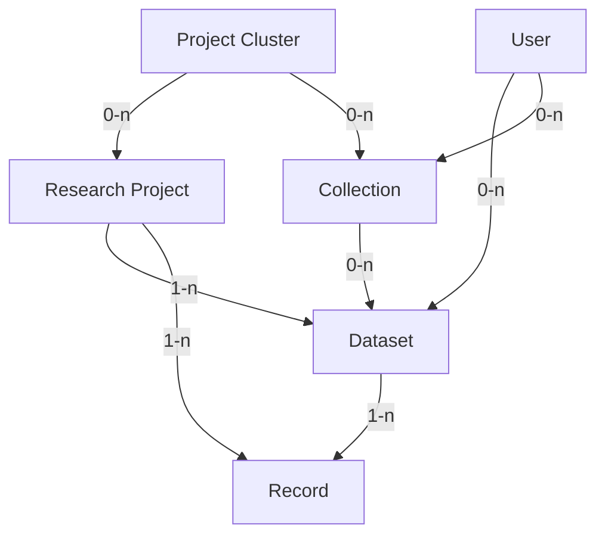

# Future Data Model

!!! warning
    This document does _not_ represent the current state of the metadata model.  
    It is a working document for planned upcoming changes to the metadata model.

!!! note
    This model is an idealized version of the metadata model.
    With the current implementation that is entirely separate from the DSP,
    it is not feasible to implement metadata on the record level.  
    Such a system will be implemented in the archive in the future,
    but for now, we will keep the metadata on the dataset level.

The enhancements to the DSP metadata model are designed to better accommodate
the inherent complexity of humanities projects, while still being flexible enough to
support simpler project structures.

One of the key improvements is the introduction of an additional hierarchical level above
the research project, which we refer to as a project cluster. This allows for a more
accurate representation of overarching initiatives that span multiple research projects
over extended periods of time. Additionally, we have implemented collections and subcollections
to facilitate more precise referencing and organization of different parts of the data,
additionally enabling projects to retain and represent historical or otherwise relevant groupings of data.

By expanding our metadata model in this way, we aim to provide a more robust framework
that supports the integrity and longevity of humanities research data. This evolution
reflects our commitment to capturing the rich, nuanced histories of research projects
with greater accuracy and detail.

!!! note
    For each property, two cardinalities are given:

    - The archival cardinality, referring to the cardinality of the property 
    once the entity is finished/finalized for archival.  
    - The in-progress cardinality, referring to the cardinality of the property
    while the entity is still in progress.

    If only one cardinality is given, it applies to both stages.

## Licensing

We consider all metadata as public domain. By signing the deposit agreement, projects must consent to that.  
This is unlike the domain metadata which is part of the project's data and hence can be licensed as the project wishes.

Whenever metadata is served to a client, it is served with legal information.  
Legal information on metadata, just as everywhere else, consists of the license, copyright holder and authorship.
The license is always "public domain", the copyright holder is always "DaSCH" 
and the authorship is always the project and DaSCH.

Metadata is always publicly available, even if the corresponding project, dataset or record is not.
This is to ensure that the metadata is always findable and reusable, even if the data itself is not.
The only exception to this is the status "embargoed", during which the metadata is _only_ available on the project level.


## Model Overview

The metadata model is a hierarchical structure of metadata elements.



- A `Project Cluster` collects `Research Projects` or nested `Project Clusters`.  
  It is typically of institutional nature,
  not directly tied to a specific funding grant,
  and may be long-lived.  
  Examples are EKWS/CAS, BEOL or LHTT.
- A `Research Project` is the main entity of the metadata model.  
  It corresponds to a `project` in the DSP.
  It is typically tied to a specific funding grant,
  and hence has a limited lifetime of ~3-5 years;
  multiple funding rounds and a longer lifetime are possible.  
  A `Research Project` is part of 0-n `Project Clusters` and it has 1-n `Datasets`.
- A `Dataset` is a semantically meaningful grouping of the `Records` of a `Research Project`.  
  If a project has different types of data, they should be separated into different datasets, 
  so that it is e.g. possible to download only the images or only the resources.  
  Datasets should be able to give  a "historical meaning" in the context of the project.  
  Examples may be physical collections such as person's "Nachlass" in an archive,
  or groupings of records based on a specific research question within a project.  
  They are referenceable and citable with a persistent identifier.  
  Initially, datasets will be associated with their respective projects,
  but in the future, users should be able to create their own datasets that are not tied to a project. 
  However, all records of a dataset must be part of the same project.
- A `Collection` is a grouping of `Datasets`.  
  They serve a comparable purpose to datasets but may be nested or span datasets of different projects.  
  In the first iteration, collections will not be implemented.
  Later on, they will initially be associated with a project or a project cluster,
  but in the future, users should be able to create their own collections that are not tied to a project.  
  They are referenceable and citable with a persistent identifier.
- A `Record` is a single entry within a project.  
  It represents the smallest unit that can meaningfully have an identifier.
  It maps to a `knora-base:Resource` (DSP-API) or an `Asset` (SIPI/Ingest) in the DSP.  
  In the case of DSP Resources, the metadata of the record is the existence of the resource itself
  as well as information such as the label, access rights, and provenance.
  The core data of the resource are the values on that resource.  
  In the case of assets, the metadata is the existence of the asset itself, as well as access rights.
  The core data is the binary information of the asset.
  A `Record` is part of exactly 1 `Research Project` and may be part of 0-n `Datasets`.

Additionally, there are the entities `Person` and `Organization`:  
`Person` and `Organization` are entities that are independent of the `Research Project` hierarchy,
and may be related to various entities within the hierarchy.

## Entity Types

### Project Cluster

| Field                   | Type          | Card. |
| ----------------------- | ------------- | ----- |
| `id`                    | id            | 1     |
| `pid`                   | id            | 1     |
| `name`                  | string        | 1     |
| `projects`              | id[]          | 0-n   |
| `projectClusters`       | id[]          | 0-n   |
| `description`           | lang_string   | 0-1   |
| `url`                   | url           | 0-1   |
| `howToCite`             | string        | 0-1   |
| `alternativeNames`      | lang_string[] | 0-n   |
| `contactPoint`          | id[]          | 0-n   |
| `documentationMaterial` | url[]         | 0-n   |

- `id`: A unique identifier for the project cluster.  
  This is the internal ID, which is not exposed to the user and is not persistent.
- `pid`: A unique persistent identifier (for now ARK URL) for the project cluster.
- `name`: The name of the project cluster.
- `projects`: A list of project identifiers that are part of the project cluster.
- `projectClusters`: A list of project cluster identifiers that are part of the project cluster,
  in case of nested project clusters.
- `description`: The description of the project cluster.
- `url`: The URL to the web presence of the project cluster.
- `howToCite`: How to cite the project cluster.  
  If not provided, we use the standard form `<name> (<year>). [Project Cluster]. DaSCH. <ARK>`.
- `alternativeNames`: Alternative names of the project cluster.
- `contactPoint`: A list of identifiers of persons or organizations responsible for the project cluster.
- `documentationMaterial`: A list of URLs pointing to documentation material related to the project cluster.

To make the model of this entity as flexible as possible,
most of the fields are optional.  
There is no difference in cardinality between the archival and in-progress stages.

### Project

| Field                   | Type                                   | Card. | WIP Card. |
| ----------------------- | -------------------------------------- | ----- | --------- |
| `id`                    | id                                     | 1     | 1         |
| `pid`                   | id                                     | 1     | 1         |
| `shortcode`             | string                                 | 1     | 1         |
| `officialName`          | string                                 | 1     | 1         |
| `status`                | string                                 | 1     | 1         |
| `name`                  | string                                 | 1     | 1         |
| `shortDescription`      | string                                 | 1     | 0-1       |
| `description`           | lang_string                            | 1     | 1         |
| `startDate`             | date                                   | 1     | 0-1       |
| `endDate`               | date                                   | 1     | 0-1       |
| `url`                   | url                                    | 1-2   | 0-2       |
| `howToCite`             | string                                 | 1     | 1         |
| `accessRights`          | accessRights                           | 1     | 1         |
| `legalInfo`             | legalInfo[]                            | 1-n   | 0-n       |
| `dataManagementPlan`    | string / url                           | 1     | 1         |
| `datasets`              | id[]                                   | 0-n   | 0-n       |
| `records`               | id[]                                   | 0-n   | 0-n       |
| `keywords`              | lang_string[]                          | 1-n   | 0-n       |
| `disciplines`           | lang_string / authorityfileReference[] | 1-n   | 0-n       |
| `temporalCoverage`      | lang_string / authorityfileReference[] | 1-n   | 0-n       |
| `spatialCoverage`       | authorityfileReference[]               | 1-n   | 0-n       |
| `attributions`          | attribution[]                          | 1-n   | 0-n       |
| `abstract`              | lang_string                            | 0-1   | 0-1       |
| `contactPoint`          | id[]                                   | 0-n   | 0-n       |
| `publications`          | publication[]                          | 0-n   | 0-n       |
| `funding`               | string / grant[]                       | 1-n   | 0-n       |
| `alternativeNames`      | lang_string[]                          | 0-n   | 0-n       |
| `documentationMaterial` | url[]                                  | 0-n   | 0-n       |

- `id`: A unique identifier for the project.  
  This is the internal ID, which is not exposed to the user and is not persistent.
- `pid`: A unique persistent identifier (for now ARK URL) for the project.
- `shortcode`: The project's DSP short code, internal only.  
  4 characters hexadecimal, upper case.  
- `status`: The status of the project.  
  Either "Ongoing" or "Finished".
- `name`: The name of the project.
- `shortDescription`: A short text to be displayed as a teaser.  
  Maximum length: 200 characters (all including).
- `description`: The full description of the project.
- `startDate`: The start date of the project.
- `endData`: The end date of the project.
- `url`: The URL to the web presence of the project.  
  The first URL should point to where the data is available,
  the second, optional URL may point to the project website.
- `howToCite`: How to cite the project.  
  If not provided, we use the standard form `<contributors> (<year>). <project name> [Database]. DaSCH. <ARK>`.
- `accessRights`: The access rights of the project.  
  Literal "Full Open Access", "Open Access with Restrictions", "Embargoed Access", "Metadata only Access".
  If the project is embargoed, the metadata is only available on the project level.
  Access rights define to what extent the project data is available to access in the DPE.
- `legalInfo`: Legal information about the project.
  Calculated from Datasets. Can _not_ be specified explicitly on the project.
- `dataManagementPlan`: A data management plan of the project.
  String or URL, use "not accessible" if not available to us.
- `datasets`: A list of dataset identifiers that make up the project data.
- `records`: A list of record identifiers that make up the project data.
- `keywords`: A list of keywords describing the project.
- `disciplines`: A list of disciplines the project is related to.
- `temporalCoverage`: A list of epoches or time periods the project is related to.
- `spatialCoverage`: A list of references to spatial entities (Places, Regions, etc.) the project is related to.
- `attributions`: A list of attributions defining what roles people/organizations have in the project.  
  Manually entered, as there may be people who don't have authorship, like reviewers, organizers, etc.
- `abstract`: An abstract of the project.
- `contactPoint`: A person or organization serving as first contact for the project.
- `publications`: A list of publications related to the project.
- `funding`: Either a string ("No funding") or a list of grants received by the project.
- `alternativeNames`: Alternative names of the project.
- `documentationMaterial`: A list of URLs pointing to documentation material related to the project.

!!! note
    In the metadata, the project has references to all its records.

    This does not mean that internally, the data is not partitioned in some way.
    This partitioning simply is not exposed to the user.

### Dataset

| Field                   | Type          | Card. | WIP-Card |
| ----------------------- | ------------- | ----- | -------- |
| `id`                    | id            | 1     | 1        |
| `pid`                   | id            | 1     | 1        |
| `name`                  | string        | 1     | 1        |
| `accessRights`          | accessRights  | 1     | 1        |
| `legalInfo`             | legalInfo[]   | 1-n   | 1-n      |
| `howToCite`             | string        | 1     | 1        |
| `description`           | lang_string   | 0-1   | 0-1      |
| `typeOfData`            | string[]      | 1-n   | 0-n      |
| `dateCreated`           | date          | 1     | 0-1      |
| `dateModified`          | date          | 0-1   | 0-1      |
| `records`               | id[]          | 1-n   | 0-n      |
| `languages`             | lang_string[] | 1-n   | 0-n      |
| `additionalMaterial`    | url[]         | 0-n   | 0-n      |
| `provenance`            | string        | 0-1   | 0-1      |
| `keywords`              | lang_string[] | 0-n   | 0-n      |
| `documentationMaterial` | url[]         | 0-n   | 0-n      |

- `id`: A unique identifier for the dataset.  
  This is the internal ID, which is not exposed to the user and is not persistent.
- `pid`: A unique persistent identifier (for now ARK URL) for the dataset.
- `name`: The title of the dataset.
- `accessRights`: The access rights of the dataset.  
  Literal "Full Open Access", "Open Access with Restrictions", "Embargoed Access", "Metadata only Access".
  Access rights define to what extent the dataset data is available to access in the DPE.
- `legalInfo`: Legal information about the dataset.  
  Calculated from records. May be added manually (if no records present yet, or if records don't have this information).
- `howToCite`: How to cite the dataset.  
  If not provided, we use the standard form `<contributors> (<year>). <dataset name> [Dataset]. DaSCH. <ARK>`.
- `description`: The description of the dataset.
- `typeOfData`: The type of data in the dataset.  
  Computed from the records if available and optionally added manually.
  Literal "XML", "Text", "Image", "Video", "Audio".
- `dateCreated`: The date when the dataset was created.
- `dateModified`: The date when the dataset was last modified.
- `records`: A list of record identifiers that make up the dataset.
- `languages`: A list of languages contained in the dataset.  
  Computed from the records if available and optionally added manually.
- `additionalMaterial`: A list of URLs related to the collection.
- `provenance`: the history of the dataset, if applicable.
- `keywords`: Keywords for search purposes.
- `documentationMaterial`: A list of URLs pointing to documentation material related to the dataset.

A project can have more than one dataset if it's the project's wish and if it provides meaningful grouping of the
records e.g., 2 researchers worked one one part of the data and the 2 other researchers on the other part of the data,
EKWS digitizing different boxes and each box becomes a dataset.
A record can only be part of one dataset.

For each project, there will eventually be multiple default datasets:

- One dataset for the entire project data.
- One dataset for the all assets of the project.
- One dataset for the all non-asset resources of the project.

Eventually, projects should be able to create their own datasets
according to what is meaningful within the project.

### Collection

| Field                   | Type          | Card. | WIP-Card. |
| ----------------------- | ------------- | ----- | --------- |
| `id`                    | id            | 1     | 1         |
| `pid`                   | id            | 1     | 1         |
| `name`                  | string        | 1     | 1         |
| `accessRights`          | accessRights  | 1     | 1         |
| `legalInfo`             | legalInfo[]   | 1-n   | 1-n       |
| `howToCite`             | string        | 1     | 1         |
| `description`           | lang_string   | 0-1   | 0-1       |
| `typeOfData`            | string[]      | 1-n   | 0-n       |
| `dateCreated`           | date          | 1     | 0-1       |
| `dateModified`          | date          | 0-1   | 0-1       |
| `datasets`              | id[]          | 0-n   | 0-n       |
| `collections`           | id[]          | 0-n   | 0-n       |
| `languages`             | lang_string[] | 1-n   | 0-n       |
| `additionalMaterial`    | url[]         | 0-n   | 0-n       |
| `provenance`            | string        | 0-1   | 0-1       |
| `keywords`              | lang_string[] | 0-n   | 0-n       |
| `documentationMaterial` | url[]         | 0-n   | 0-n       |

- `id`: A unique identifier for the collection.  
  This is the internal ID, which is not exposed to the user and is not persistent.
- `pid`: A unique persistent identifier (for now ARK URL) for the collection.
- `name`: The name of the collection.
- `accessRights`: The access rights of the collection.  
  Literal "Full Open Access", "Open Access with Restrictions", "Embargoed Access", "Metadata only Access".
  Access rights define to what extent the collection data is available to access in the DPE.
- `legalInfo`: Legal information about the collection.  
  Calculated from datasets/sub-collections. May be added manually.
- `howToCite`: How to cite the collection.  
  If not provided, we use the standard form `<contributors> (<year>). <collection name> [Collection]. DaSCH. <ARK>`.
- `description`: The description of the collection.
- `typeOfData`: The type of data in the collection.  
  Computed from the records if available and optionally added manually.
  Literal "XML", "Text", "Image", "Video", "Audio".
- `dateCreated`: The date when the collection was created.
- `dateModified`: The date when the collection was last modified.
- `datasets`: A list of dataset identifiers that make up the collection.
- `collections`: A list of collection identifiers that make up the collection, if nested.
- `languages`: A list of languages contained in the collection.  
  Computed from the records if available and optionally added manually.
- `additionalMaterial`: A list of URLs related to the collection.
- `provenance`: The provenance of the collection.
- `keywords`: A list of keywords describing the collection.
- `documentationMaterial`: A list of URLs pointing to documentation material related to the collection.

### Record

| Field           | Type          | Card. | WIP-Card. |
| --------------- | ------------- | ----- | --------- |
| `id`            | id            | 1     | 1         |
| `pid`           | id            | 1     | 1         |
| `label`         | lang_string   | 1     | 1         |
| `accessRights`  | string        | 1     | 1         |
| `legalInfo`     | legalInfo     | 1     | 1         |
| `howToCite`     | string        | 1     | 1         |
| `publisher`     | string        | 1     | 1         |
| `source`        | string        | 0-1   | 0-1       |
| `description`   | lang_string   | 0-1   | 0-1       |
| `dateCreated`   | date          | 0-1   | 0-1       |
| `dateModified`  | date          | 0-1   | 0-1       |
| `datePublished` | date          | 0-1   | 0-1       |
| `typeOfData`    | string        | 0-1   | 0-1       |
| `size`          | string        | 0-1   | 0-1       |
| `keywords`      | lang_string[] | 0-n   | 0-n       |

- `id`: A unique identifier for the record.  
  This is the internal ID, which is not exposed to the user and is not persistent.
- `pid`: A unique persistent identifier (for now ARK URL) for the record.
- `label`: The label of the record.  
  For assets, this may be the original file name.  
  For IIIF URLs, this may be good to have for the case when the URL is no longer available.  
  In the long run, we would want to have IIIF Manifests, not Image URLs, so that we can extract labels from there.
- `accessRights`: The access rights of the record.  
  Literal "Full Open Access", "Open Access with Restrictions", "Embargoed Access", "Metadata only Access".
  Access rights define to what extent the record data is available to access in the DPE.
- `legalInfo`: Legal information about the record.
- `howToCite`: How to cite the record.  
  If not provided, we use the standard form `<label> (<creation year>). [Data Record]. DaSCH. <ARK>`.
- `publisher`: The publisher of the record.  
  Literal "DaSCH". Required for OpenAIRE compliance.
- `source`: The provenance of the record.  
  Recommended for [openAIRE](https://guidelines.openaire.eu/en/latest/literature/field_source.html):
  Only use if the record is a digitization of a non-digital source,
  in which case this property should identify the original source.
- `description`: The description of the record.  
  If the project does not want descriptions to be public domain and always open, it must not use this property,
  but instead create a custom property for it.
- `dateCreated`
- `dateModified`
- `datePublished`: the date when the record was made publicly available.  
  This is normally the date when the record is moved to the archive.  
  If the record is under embargo, this will be the date when the embargo is lifted.
- `typeOfData`: The type of data in the record.
  Literal "XML", "Text", "Image", "Video", "Audio".
- `size`: The size of the record.  
  [openAIRE Size](https://openaire-guidelines-for-literature-repository-managers.readthedocs.io/en/v4.0.0/field_size.html#dci-size)
- `keywords`: keywords for search purposes.

### Person

| Field            | Type                     | Card. |
| ---------------- | ------------------------ | ----- |
| `id`             | id                       | 1     |
| `pid`            | id                       | 1     |
| `sameAs`         | authorityfileReference[] | 0-n   |
| `givenNames`     | string[]                 | 1-n   |
| `familyNames`    | string[]                 | 1-n   |
| `honoraryPrefix` | string[]                 | 0-n   |
| `honorarySuffix` | string[]                 | 0-n   |
| `affiliations`   | id[]                     | 0-n   |
| `email`          | string                   | 0-n   |
| `address`        | address                  | 0-1   |

Cardinality is the same for both stages.

- `id`: A unique identifier for the person.  
  This is the internal ID, which is not exposed to the user and is not persistent.
- `pid`: A unique persistent identifier (for now ARK URL) for the person.
- `sameAs`: References to external authority files. (ORCID, VIAF, GND…)
- `givenNames`: The given names of the person.
- `familyNames`: The family names of the person.
- `honoraryPrefix`: The honorary prefixes of the person, e.g. "Prof. Dr.".
- `honorarySuffix`: The honorary suffixes of the person, e.g. "PhD", "MA".
- `affiliations`: The affiliations of the person to organizations.
- `email`: The email address of the person.
- `address`: The post address of the person.  
  This should not be the personal address, but the specific address of the person at theyr organization.

### Organization

| Field             | Type                     | Card. |
| ----------------- | ------------------------ | ----- |
| `id`              | id                       | 1     |
| `pid`             | id                       | 1     |
| `sameAs`          | authorityfileReference[] | 0-n   |
| `name`            | string                   | 1     |
| `url`             | url                      | 1     |
| `address`         | address                  | 0-1   |
| `email`           | string                   | 0-1   |
| `alternativeName` | lang_string              | 0-1   |

Cardinality is the same for both stages.

- `id`: A unique identifier for the organization.  
  This is the internal ID, which is not exposed to the user and is not persistent.
- `pid`: A unique persistent identifier (for now ARK URL) for the organization.
- `sameAs`: References to external authority files. ([ROR](https://ror.org/))
- `name`: The name of the organization.
- `url`: The URL of the organization.
- `address`: The address of the organization.
- `email`: The email address of the organization.
- `alternativeName`: Alternative names of the organization.

## Value Types

### String with Language Tag (`lang_string`)

Object with an ISO language code as key and a string as value.

```json
{
  "en": "Lorem ipsum in English.",
  "de": "Lorem ipsum auf Deutsch."
}
```

This means that for a single lang_string value, there can be multiple translations.

### Authority File Reference

An object representing a reference to an external authority file.

| Field  | Type   | Card. |
| ------ | ------ | ----- |
| `type` | string | 1     |
| `url`  | url    | 1     |
| `text` | string | 0-1   |

- `type`: The type of the Authority File Reference.  
  Literal 'Geonames', 'Pleiades', 'Skos', 'Periodo', 'Chronontology', 'GND', 'VIAF', 'Grid', 'ORCID',
  'Creative Commons', 'COAR'  
  This is used to determine the semantics of the URL.
- `url`: The URL itself.
- `text`: A human-readable text for display.

### PID

A persistent identifier. May be an ARK or a DOI.

| Field  | Type   | Card. |
| ------ | ------ | ----- |
| `url`  | url    | 1     |
| `text` | string | 0-1   |

### Publication

| Field  | Type   | Card. |
| ------ | ------ | ----- |
| `text` | string | 1     |
| `pid`  | pid    | 0-1   |

- `text`: The text of the publication.
- `pid`: A URL to the publication, if e.g. a DOI is available.

### Address

| Field        | Type   | Card. |
| ------------ | ------ | ----- |
| `street`     | string | 1     |
| `postalCode` | string | 1     |
| `locality`   | string | 1     |
| `country`    | string | 1     |
| `canton`     | string | 0-1   |
| `additional` | string | 0-1   |

- `street`: The street of the address.
- `postalCode`: The postal code of the address.
- `locality`: The locality of the address.
- `country`: The country of the address.
- `canton`: The canton of the address.
- `additional`: Additional information about the address, if needed.

### Grant

| Field     | Type   | Cardinality | Restrictions               |
| --------- | ------ | ----------- | -------------------------- |
| `funders` | id[]   | 1-n         | Person or Organization IDs |
| `number`  | string | 0-1         |                            |
| `name`    | string | 0-1         |                            |
| `url`     | url    | 0-1         |                            |

### Legal Info

| Field             | Type     | Card. | WIP Card. |
| ----------------- | -------- | ----- | --------- |
| `license`         | license  | 1     | 1         |
| `copyrightHolder` | string   | 1     | 1         |
| `authorship`      | string[] | 1-n   | 1-n       |

### License

| Field               | Type   | Card. | WIP Card. |
| ------------------- | ------ | ----- | --------- |
| `licenseIdentifier` | string | 1     | 1         |
| `licenseDate`       | date   | 1     | 1         |
| `licenseURI`        | url    | 1     | 1         |

### Attribution

Modelled according to the [OpenAIRE guidelines](https://guidelines.openaire.eu/en/latest/data/field_contributor.html).

| Field             | Type   | Card. |
| ----------------- | ------ | ----- |
| `contributor`     | id     | 1     |
| `contributorType` | string | 1-n   |

### Access Rights

| Field          | Type                         | Card. |
| -------------- | ---------------------------- | ----- |
| `accessRights` | authorityfileReference::COAR | 1     |
| `embargoDate`  | date                         | 0-1   |

- `accessRights`: The access rights of the record.  
  Literal "Full Open Access", "Open Access with Restrictions", "Embargoed Access", "Metadata only Access".
- `embargoDate`: The date when the embargo ends.

## Later

- Provenance:
    - [https://www.w3.org/TR/vocab-dcat-3](https://www.w3.org/TR/vocab-dcat-3/#examples-dataset-provenance)
    - [https://www.w3.org/TR/prov-o/](https://www.w3.org/TR/prov-o/)
    - track provenance of dataset etc. through time (even before entered)
    - could also track version history in the archive (predecessor)
- Model Person and Organization in a re-useable fashion. This should include making stuff like affiliation time/project bound
- Alongside keywords, we could also have categories. Where keywords are free text, categories are from a controlled vocabulary.

## JSON Schema

a draft of the data model as JSON Schema is on [github](https://github.com/dasch-swiss/pipeline-metadata-schema/tree/main/schema)

## Examples

### Project Cluster

```json
{
  "accessRights": {
    "license": {
      "licenseIdentifier": "public domain",
      "licenseDate": "2023-01-01",
      "licenseURI": "https://www.dasch.swiss/licenses/public-domain"
    },
    "copyrightHolder": "DaSCH",
    "authorship": [
        "DaSCH",
        "Project Cluster XYZ"
      ]
  },
  "metadata": {
    "id": "cluster-0001",
    "pid": "https://ark.dasch.swiss/ark:/72163/1/cluster-0001",
    "name": "Project Cluster Name",
    "projects": ["project-0001", "project-0002"],
    "projectClusters": ["cluster-0002"],
    "description": {
      "en": "Project Cluster Description",
      "de": "Projektcluster Beschreibung"
    },
    "url": "https://example.com/project-cluster",
    "howToCite": "Project Cluster Name (2025). [Project Cluster]. DaSCH. https://ark.dasch.swiss/ark:/72163/1/cluster-0001",
    "alternativeNames": [
      {
        "en": "Alternative Name",
        "de": "Alternativer Name"
      }
    ],
    "contactPoint": ["person-0001", "organization-0001"],
    "documentationMaterial": ["https://example.com/documentation"]
  }
}
```

### Project

```json
{
  "accessRights": {
    "license": {
      "licenseIdentifier": "public domain",
      "licenseDate": "2023-01-01",
      "licenseURI": "https://www.dasch.swiss/licenses/public-domain"
    },
    "copyrightHolder": "DaSCH",
    "authorship": [
        "DaSCH",
        "Project XYZ"
      ]
  },
  "metadata": {
    "id": "project-0001",
    "pid": "https://ark.dasch.swiss/ark:/72163/1/project-0001",
    "shortcode": "1234",
    "officialName": "Project Official Name",
    "status": "Ongoing",
    "name": "Project Name",
    "shortDescription": "Short description of the project.",
    "description": {
      "en": "Project Description",
      "de": "Projektbeschreibung"
    },
    "startDate": "2023-01-01",
    "endDate": "2028-01-01",
    "url": [
      "https://data.dasch.swiss/projects/project-0001",
      "https://example.com/project-website"
    ],
    "howToCite": "Project Name (2025). [Project]. DaSCH. https://ark.dasch.swiss/ark:/72163/1/project-0001",
    "accessRights": "Full Open Access",
    "legalInfo": [
      {
        "license": {
          "licenseIdentifier": "CC-BY-4.0",
          "licenseDate": "2023-01-01",
          "licenseURI": "https://creativecommons.org/licenses/by/4.0/"
        }
      }
    ],
    "dataManagementPlan": "https://example.com/dmp",
    "datasets": ["dataset-0001", "dataset-0002"],
    "records": ["record-0001", "record-0002"],
    "keywords": [
      {
        "en": "Keyword 1",
        "de": "Stichwort 1"
      }
    ],
    "disciplines": [
      {
        "en": "Discipline 1",
        "de": "Disziplin 1"
      }
    ],
    "temporalCoverage": [
      {
        "en": "Temporal Coverage 1",
        "de": "Zeitliche Abdeckung 1"
      }
    ],
    "spatialCoverage": [
      {
        "type": "Geonames",
        "url": "https://www.geonames.org/1234567",
        "text": {
          "en": "Spatial Coverage 1",
          "de": "Räumliche Abdeckung 1"
        }
      }
    ],
    "attributions": [
      {
        "contributor": "person-0001",
        "contributorType": ["author", "editor"]
      }
    ],
    "abstract": {
      "en": "Project Abstract",
      "de": "Projektzusammenfassung"
    },
    "contactPoint": ["person-0001", "organization-0001"],
    "publications": [
      {
        "text": "Publication Title",
        "pid": "https://doi.org/10.1234/5678"
      }
    ],
    "funding": [
      {
        "funders": ["organization-0001"],
        "number": "123456",
        "name": "Grant Name",
        "url": "https://example.com/grant"
      }
    ],
    "alternativeNames": [
      {
        "en": "Alternative Name",
        "de": "Alternativer Name"
      }
    ],
    "documentationMaterial": ["https://example.com/documentation"]
  }
}
```

### Dataset


```json
{
  "accessRights": {
    "license": {
      "licenseIdentifier": "public domain",
      "licenseDate": "2023-01-01",
      "licenseURI": "https://www.dasch.swiss/licenses/public-domain"
    },
    "copyrightHolder": "DaSCH",
    "authorship": [
        "DaSCH",
        "Project XYZ"
      ]
  },
  "metadata": {
    "id": "dataset-0001",
    "pid": "https://ark.dasch.swiss/ark:/72163/1/dataset-0001",
    "name": "Dataset Name",
    "accessRights": "Full Open Access",
    "legalInfo": [
      {
        "license": {
          "licenseIdentifier": "CC-BY-4.0",
          "licenseDate": "2023-01-01",
          "licenseURI": "https://creativecommons.org/licenses/by/4.0/"
        }
      }
    ],
    "howToCite": "Dataset Name (2025). [Dataset]. DaSCH. https://ark.dasch.swiss/ark:/72163/1/dataset-0001",
    "description": {
      "en": "Dataset Description",
      "de": "Datensatzbeschreibung"
    },
    "typeOfData": ["XML", "Text"],
    "dateCreated": "2023-01-01",
    "dateModified": "2023-01-02",
    "records": ["record-0001", "record-0002"],
    "languages": [
      {
        "en": "English",
        "de": "Deutsch"
      }
    ],
    "additionalMaterial": ["https://example.com/additional-material"],
    "provenance": "Dataset provenance information.",
    "keywords": [
      {
        "en": "Keyword 1",
        "de": "Stichwort 1"
      }
    ],
    "documentationMaterial": ["https://example.com/documentation"]
  }
}
```
