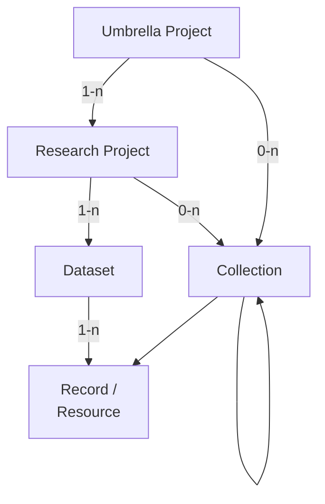

# Future Data Model

!!! warning
    This document does _not_ represent the current state of the metadata model.  
    It is a working document for planned upcoming changes to the metadata model.

!!! note
    This model is an idealized version of the metadata model. 
    With the current implementation that is entirely separate from the DSP,
    it is not feasible to implement metadata on the record level.  
    Such a system may be implemented in the archive in the future,
    but for now, we will keep the metadata on the dataset level.  
    A separate, simplified model for applying some of these changes, 
    while remaining compatible with the current implementation,
    should be created alongside this model.

The enhancements to the DSP metadata model are thoughtfully designed to better accommodate
the inherent complexity of humanities projects, while still being flexible enough to
support simpler project structures.
    
One of the key improvements is the introduction of an additional hierarchical level above
the research project, which we refer to as the umbrella project. This allows for a more
accurate representation of overarching initiatives that span multiple research projects
over extended periods. Additionally, we have implemented collections and subcollections
to facilitate more precise referencing and organization of different parts of the data.
    
By expanding our metadata model in this way, we aim to provide a more robust framework
that supports the integrity and longevity of humanities research data. This evolution
reflects our commitment to capturing the rich, nuanced histories of research projects
with greater accuracy and detail.
    
## Overview

The metadata model is a hierarchical structure of metadata elements. 



- A `Umbrella Project` is optional and collects one or more `Research Projects`.  
  It is typically of institutional nature, 
  not directly tied to a specific funding grant, 
  and may be long-lived.  
  Examples are EKWS/CAS, BEOL or LIMC.
- A `Research Project` is the main entity of the metadata model.  
  It corresponds to a `project` in the DSP.
  It is typically tied to a specific funding grant, 
  and hence has a limited lifetime of ~3-5 years;
  multiple funding rounds and a longer lifetime are possible.  
  A `Research Project` is part of 0-1 `Umbrella Project`,
  it has 1-n `Datasets` and 0-n `Collections`.
- A `Dataset` is a collection of `Records` within a `Research Project`.  
  It is mostly meant for system-internal and technical use,
  and should not have particular semantics or a "historical meaning" in the context of the project.  
  A `Dataset` is part of exactly 1 `Research Project`
  and contains 1-n `Records`.
- A `Collection` is also a collection of `Records` within a `Research Project`.  
  It is meant for semantic grouping of `Records` within a `Research Project`,
  and may have a "historical meaning" in the context of the project.  
  Examples may be physical collections such as p person's "Nachlass" in an archive,
  or groupings of records based on a specific research question within a project.  
  A `Collection` is part of at least 1 `Research Project`, `Umbrella Project` or `Collection`, 
  but can be part of multiple. It may either contain 0-n `Collections` or 1-n `Records`.
- A `Record` is a single resource within a `Dataset`.  
  It represents a single entity, and the smallest unit that can meaningfully have an identifier. 
  It maps to a `knora-base:Resource` (DSP-API) or an `Asset` (SIPI/Ingest) in the DSP.  
  A `Record` is part of exactly 1 `Dataset` and may be part of 0-n `Collections`. 

Additionally, there are the entities `Person` and `Organization`:  
`Person` and `Organization` are entities that are independent of the `Research Project` hierarchy,
and may be related to various entities within the hierarchy.  


## Top Level

A set of metadata consists of the following top-level elements:

- Umbrella Project
- Project
- Dataset
- Collection
- Record
- Person
- Organization

Each of these elements is an entity identified by a unique identifier. 
Other elements can refer to these entities by their identifier.

Any other metadata element may itself be a complex object,
but it is always part of one of the top-level elements.
Such elements do not have an identifier, 
but are identified by their position in the hierarchy.

| Field             | Type            | Cardinality |
| ----------------- | --------------- | ----------- |
| `$schema`         | string          | 0-1         |
| `umbrellaProject` | umbrellaProject | 0-1         |
| `project`         | project         | 1           |
| `datasets`        | dataset[]       | 1-n         |
| `collections`     | collection[]    | 0-n         |
| `records`         | record[]        | 0-n         |
| `persons`         | person[]        | 0-n         |
| `organizations`   | organization[]  | 0-n         |


!!! question
    Do we consider "permissions" as metadata?  
    (Not as they are in the DSP, but as they will be in the archive; 
    that is: "open", "restricted", "embargo", "metadata only".)  
    If so, this should be added on each level, I suppose.


## Types

### Entity Types

#### Unbrella Project

| Field                  | Type          | Card. | Restrictions                                                 |
| ---------------------- | ------------- | ----- | ------------------------------------------------------------ |
| `__id`                 | string        | 1     |                                                              |
| `__type`               | string        | 1     | Literal 'UmbrellaProject'                                    |
| `name`                 | string        | 1     |                                                              |
| `projects`             | id[]          | 1-n   | String containing the identifier of a project                |
| `description`          | lang_string   | 0-1   |                                                              |
| `alternativeNames`     | lang_string[] | 0-n   |                                                              |
| `url`                  | url           | 0-1   |                                                              |
| `contactPoint`         | id            | 0-1   | String containing the identifier of a person or organization |
| `institutionalPartner` | id[]          | 0-n   | String containing the identifier of an organization          |

!!! question
    This opens up the questions of how to deal with multiple projects in a umbrella project. 
    We probably want to keep one entry per project, 
    so this leaves us with either duplicating the umbrella project metadata for each project,
    or having umbrella project metadata separately and only linking it from the project.
    The latter seems preferable, 
    but then the question arises who gets to edit the umbrella project metadata.  
    For a first implementation, we could simply duplicate the metadata for each project, 
    and later factor it out.

!!! question
    what is the best name for `institutionalPartner`?  
    AI suggested:  
    - Affiliated Institution  
    - Associated Body  
    - Supporting Organization  
    - Institutional Partner

!!! question
    How do we capture the time aspect of the data provenance and genesis in this context? Should this be here?  
    Concretely, an umbrella project is often like a "timeline" of projects, or the "history" of a series of projects.

To make the model of this entity as flexible as possible,
most of the fields are optional.


#### Project

| Field                | Type                | Cardinality | Restrictions                                                 |
| -------------------- | ------------------- | ----------- | ------------------------------------------------------------ |
| `__type`             | string              | 1           | Literal "Project"                                            |
| `shortcode`          | string              | 1           | 4 char hexadecimal                                           |
| `status`             | string              | 1           | Literal "Ongoing" or "Finished"                              |
| `name`               | string              | 1           |                                                              |
| `description`        | lang_string         | 1           |                                                              |
| `startDate`          | date                | 1           | String of format "YYYY-MM-DD"                                |
| `teaserText`         | string              | 1           |                                                              |
| `url`                | url                 | 1           |                                                              |
| `howToCite`          | string              | 1           |                                                              |
| `datasets`           | id[]                | 1-n         | String containing the identifier of a dataset                |
| `keywords`           | lang_string[]       | 1-n         |                                                              |
| `disciplines`        | lang_string / url[] | 1-n         |                                                              |
| `temporalCoverage`   | lang_string / url[] | 1-n         |                                                              |
| `spatialCoverage`    | url[]               | 1-n         |                                                              |
| `funders`            | id[]                | 1-n         | String containing the identifier of a person or organization |
| `attributions`       | attribution[]       | 1-n         |                                                              |
| `endDate`            | date                | 0-1         | String of format "YYYY-MM-DD"                                |
| `secondaryURL`       | url                 | 0-1         |                                                              |
| `dataManagementPlan` | dmp                 | 0-1         |                                                              |
| `contactPoint`       | id                  | 0-1         | String containing the identifier of a person or organization |
| `publications`       | publication[]       | 0-n         |                                                              |
| `grants`             | grant[]             | 0-n         |                                                              |
| `alternativeNames`   | lang_string[]       | 0-n         |                                                              |

!!! question
    If we can have copyright/license on dataset level,
    do we want to have it on project level as well?  
    In any case, it should be computed from the datasets/records.

!!! question
    Do we still need funders if we have grants?

!!! question
    What about projects that do not have funding?

!!! question
    Do we want my proposed `attributions` field n project?

!!! question
    Should we have an `abstract` field in the project, like we used to have in the dataset?


#### Dataset

| Field          | Type          | Cardinality | Restrictions                                     | Remarks                                                 |
| -------------- | ------------- | ----------- | ------------------------------------------------ | ------------------------------------------------------- |
| `__id`         | string        | 1           |                                                  |                                                         |
| `__type`       | string        | 1           | Literal "Dataset"                                |                                                         |
| `title`        | string        | 1           |                                                  | may be auto-generated?                                  |
| `typeOfData`   | string[]      | 1-n         | Literal "XML", "Text", "Image", "Video", "Audio" | does this still make sense? should it be cardinality 1? |
| `licenses`     | license[]     | 1-n         |                                                  | should be computed from the records                     |
| `copyright`    | string[]      | 1-n         |                                                  | computed along with license                             |
| `attributions` | attribution[] | 1-n         |                                                  | can this be computed?                                   |
| `howToCite`    | string        | 0-1         |                                                  | still wanted?                                           |
| `description`  | lang_string   | 0-1         |                                                  |                                                         |
| `dateCreated`  | date          | 0-1         |                                                  |                                                         |

!!! note
    If we think of a dataset as something internal, 
    we should limit the metadata to what is necessary for the system to work.  
    Additionally, we may want to have some minimal descriptive metadata for the dataset, 
    (like for the use case that a project once a year grabs a box of achrival material and digitizes it). 

!!! question
    Do we need to store the license on the dataset level, 
    or can we compute it from the records?  
    If we store it on the dataset level, 
    how do we deal with datasets that contain records with different licenses?

!!! question
    Do we need to store the language on the dataset level, 
    or can we compute it from the records?  
    If we store it on the dataset level, 
    how do we deal with datasets that contain records in different languages?

!!! question
    Do we need to store the attribution on the dataset level, 
    or can we compute it from the records?  
    If we store it on the dataset level, 
    how do we deal with datasets that contain records with different attributions?

!!! question
    Do we need a reference to the records in the dataset?

!!! question
    Does `dateCreated` suffice here? There were more date properties in the old model.

Data sets arefor internal use, 
they serve to partition the data into manageable chunks. 
This is done both by type of data (RDF vs. assets), and by size.

In some cases, there may be a "logical" grouping consisting a dataset, 
e.g. if data is digitized in a batch and there is a temporal separation between the batches.  
In these cases, the project may make use of the descriptive metadata of the dataset. 
But normally, the dataset is just a technical entity, and should not carry semantic information.

#### Collection

| Field              | Type              | Cardinality | Restrictions                                     | Remarks                                                  |
| ------------------ | ----------------- | ----------- | ------------------------------------------------ | -------------------------------------------------------- |
| `__id`             | string            | 1           |                                                  |                                                          |
| `__type`           | string            | 1           | Literal 'Collection'                             |                                                          |
| `name`             | string            | 1           |                                                  |                                                          |
| `description`      | string / url      | 1-n         |                                                  |                                                          |
| `typeOfData`       | string[]          | 1-n         | Literal "XML", "Text", "Image", "Video", "Audio" | copied from dataset; does this still make sense?         |
| `licenses`         | license[]         | 1-n         |                                                  | copied from dataset; should be computed from the records |
| `copyright`        | string[]          | 1-n         |                                                  | computed along with license                              |
| `languages`        | lang_string[]     | 1-n         |                                                  | copied from dataset; does this make sense?               |
| `attributions`     | attribution[]     | 1-n         |                                                  | copied from dataset; can this be calculated?             |
| `provenance`       | string            | 0-1         |                                                  |                                                          |
| `distribution`     | url               | 0-1         |                                                  | copied from dataset; does this make sense?               |
| `records`          | id[]              | 0-n         | Record IDs                                       | can be 0 in case it points to a collection               |
| `collections`      | id[]              | 0-n         | Collection IDs                                   |                                                          |
| `alternativeNames` | lang_string[]     | 0-n         |                                                  |                                                          |
| `keywords`         | lang_string[]     | 0-n         |                                                  | does this make sense?                                    |
| `urls`             | url[]             | 0-n         |                                                  | copied from dataset;                                     |
| `additional`       | lang_string / url | 0-n         |                                                  | copied from dataset;                                     |


!!! question
    Do we need a reference to the records in the collection?


#### Record

| Field              | Type        | Cardinality | Restrictions                                     | Remarks                                                  |
| ------------------ | ----------- | ----------- | ------------------------------------------------ | -------------------------------------------------------- |
| `__id`             | string      | 1           |                                                  |                                                          |
| `__type`           | string      | 1           | Literal 'Record'                                 |                                                          |
| `pid`              | id          | 1           |                                                  | or `ARK`?                                                |
| `label`            | lang_string | 1           |                                                  | do we want this, or does it go too far?                  |
| `accessConditions` | string      | 1           | Literal "open", "restricted" or "closed"         | copied from dataset; change to proper terms              |
| `license`          | license     | 1           |                                                  | copied from dataset; should be computed from the records |
| `copyright`        | string      | 1           |                                                  | computed along with license                              |
| `attribution`      | attribution | 1           |                                                  | do we want this, or does it go too far?                  |
| `provenance`       | string      | 0-1         |                                                  | do we want this, or does it go too far?                  |
| `datePublished`    | date        | 0-1         |                                                  | copied from dataset; do they make sense?                 |
| `dateCreated`      | date        | 0-1         |                                                  | copied from dataset; do they make sense?                 |
| `dateModified`     | date        | 0-1         |                                                  | copied from dataset; do they make sense?                 |
| `typeOfData`       | string      | 0-1         | Literal "XML", "Text", "Image", "Video", "Audio" | copied from dataset; wanted? what values?                |

!!! question
    How granular do we want to be with the metadata on the record level?

!!! question
    If we have copyright, what is the purpose of attribution?


#### Person

| Field            | Type     | Cardinality | Restrictions                           | Remarks |
| ---------------- | -------- | ----------- | -------------------------------------- | ------- |
| `__id`           | string   | 1           |                                        |         |
| `__type`         | string   | 1           | Literal 'Person'                       |         |
| `givenNames`     | string[] | 1-n         |                                        |         |
| `familyNames`    | string[] | 1-n         |                                        |         |
| `jobTitles`      | string[] | 0-n         |                                        |         |
| `affiliations`   | id[]     | 0-n         | Organization IDs                       |         |
| `address`        | address  | 0-1         |                                        |         |
| `email`          | string   | 0-1         |                                        |         |
| `secondaryEmail` | string   | 0-1         |                                        |         |
| `authorityRefs`  | url[]    | 0-n         | References to external authority files |         |


#### Organization

| Field             | Type        | Cardinality | Restrictions                           | Remarks |
| ----------------- | ----------- | ----------- | -------------------------------------- | ------- |
| `__id`            | string      | 1           |                                        |         |
| `__type`          | string      | 1           | Literal 'Organization'                 |         |
| `name`            | string      | 1           |                                        |         |
| `url`             | url         | 1           |                                        |         |
| `address`         | address     | 0-1         |                                        |         |
| `email`           | string      | 0-1         |                                        |         |
| `alternativeName` | lang_string | 0-1         |                                        |         |
| `authorityRefs`   | url[]       | 0-n         | References to external authority files |         |


### Value Types

#### String with Language Tag (`lang_string`)

Object with an ISO language code as key and a string as value.

```json
{
    "en": "Lorem ipsum in English.",
    "de": "Lorem ipsum auf Deutsch."
}
```


#### Date

String with the format `YYYY-MM-DD`.


#### URL

An object representing a URL. 
Depending on the `type` field,
the URL may be a generic URL
or a more specific link, like a PID
or a reference to a resource in an external authority file.


| Field    | Type   | Cardinality | Restrictions                                                                                                                                |
| -------- | ------ | ----------- | ------------------------------------------------------------------------------------------------------------------------------------------- |
| `__type` | string | 1           | Literal 'URL'                                                                                                                               |
| `type`   | string | 1           | Literal 'URL', 'Geonames', 'Pleiades', 'Skos', 'Periodo', 'Chronontology', 'GND', 'VIAF', 'Grid', 'ORCID', 'Creative Commons', 'DOI', 'ARK' |
| `url`    | string | 1           |                                                                                                                                             |
| `text`   | string | 0-1         |                                                                                                                                             |

!!! question
    can we model different types of URLs in a more sensible way?


#### Data Management Plan (`dmp`)

| Field       | Type    | Cardinality | Restrictions                 |
| ----------- | ------- | ----------- | ---------------------------- |
| `__type`    | string  | 1           | Literal 'DataManagementPlan' |
| `available` | boolean | 0-1         |                              |
| `url`       | url     | 0-1         |                              |


!!! question
    Does the model for `Data Management Plan` still make sense? 
    Could it be a string? 
    Is "available" useful information? 
    How do we ensure that either `available` or `url` is set?


#### Publication

| Field  | Type   | Cardinality | Restrictions |
| ------ | ------ | ----------- | ------------ |
| `text` | string | 1           |              |
| `url`  | url    | 0-1         |              |


#### Address

| Field        | Type   | Cardinality | Restrictions      |
| ------------ | ------ | ----------- | ----------------- |
| `__type`     | string | 1           | Literal 'Address' |
| `street`     | string | 1           |                   |
| `postalCode` | string | 1           |                   |
| `locality`   | string | 1           |                   |
| `country`    | string | 1           |                   |
| `canton`     | string | 0-1         |                   |
| `additional` | string | 0-1         |                   |


#### License

| Field     | Type   | Cardinality | Restrictions      |
| --------- | ------ | ----------- | ----------------- |
| `__type`  | string | 1           | Literal 'License' |
| `license` | url    | 1           |                   |
| `date`    | date   | 1           |                   |
| `details` | string | 0-1         |                   |

!!! question
    Is this model up to date with our current understanding of licenses? 
    Is `details` ever used? 
    What is the purpose of `date` here? 
    How does it relate to a copyright statement?


#### Attribution

| Field    | Type   | Cardinality | Restrictions              | Remark                      |
| -------- | ------ | ----------- | ------------------------- | --------------------------- |
| `__type` | string | 1           | Literal 'Attribution'     |                             |
| `agent`  | id     | 1           | Person or Organization ID | Or can this only be person? |
| `roles`  | string | 1-n         |                           |                             |


#### Grant

| Field     | Type   | Cardinality | Restrictions               |
| --------- | ------ | ----------- | -------------------------- |
| `__type`  | string | 1           | Literal 'Grant'            |
| `funders` | id[]   | 1-n         | Person or Organization IDs |
| `number`  | string | 0-1         |                            |
| `name`    | string | 0-1         |                            |
| `url`     | url    | 0-1         |                            |


## Entity-Relationship Diagram


## Change Log


- Make `Grant` a value type and remove it from the top level.
- Added entity `umbrellaProject` to the top level.
- Added entity `collection` to the top level.
- Added entity `record` to the top level.
- Added `copyright` to `dataset`.
- Changed type of `abstract`/`description` in `dataset` to `lang_string`.
- Changed cardinality of `abstract`/`description` in `dataset` to 1.
- Changed cardinality of `howToCite` in `dataset` to 0-1.
- Changed cardinality of `description` in `dataset` to 0-1.
- Removed `accessConditions` from `dataset`.
- Removed `status` from `dataset`.
- Renamed `abstract` to `description` in `dataset`.
- Removed `languages` from `dataset`.
- Removed `datePublished`, and `dateModified` from `dataset`.
- Removed `distribution` from `dataset`.
- Removed `additional` from `dataset`.
- Removed `alternativeTitles` from `dataset`.
- Removed `urls` from `dataset`.
